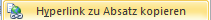
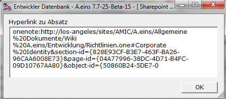
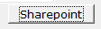

# Sharepoint

<!-- source: https://amic.de/hilfe/_sharepoint.htm -->

Hiermit besitzt man die Möglichkeit Sharepoint-Adressen (genauer Onenote-Verweise) pro Kunde zu hinterlegen.

Ist noch keine solche Adresse hinterlegt so erfolgt zunächst die Erfassung einer Adresse durch einen dafür vorgesehenen Dialog.

Die Adressen können im Onenote per  erfasst werden und per **Ctrl**+**V** in die Eingabemaske verbracht werden,

also zum Beispiel:

Die Eingabe muss per  bestätigt werden.

Hiernach wird ein „Klick“ auf  nun die entsprechende Adresse versuchen zu öffnen.

Folgende Funktionen stehen extra bzw. alternativ zur Verfügung:

***Sharepoint rücksetzen***: löscht die Adresse

***Sharepoint anzeigen***: wie Klick auf 

***Sharepoint pflegen***: ruft den Eingabedialog zum Pflegen der Adresse auf

***Sharepoint debuggen***: um überhaupt eine Möglichkeit zu haben, die Adressen EDV-technisch zu begutachten

Hinweis: Es können keine „normalen“ Internet-Adressen mit dieser Technik zur Ansicht gebracht werden!
