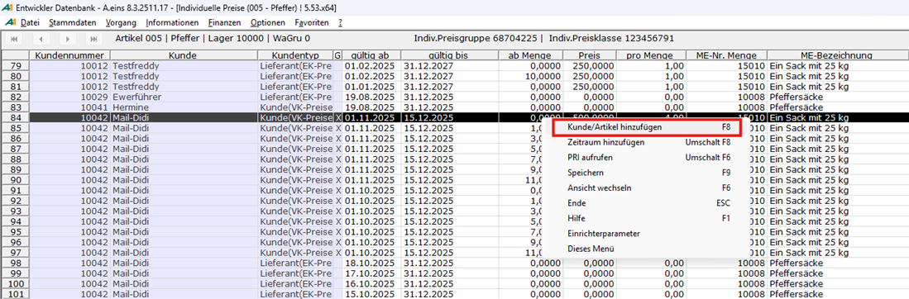
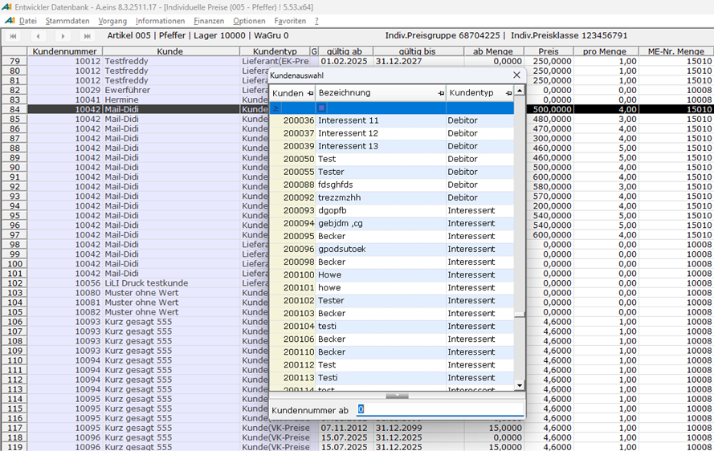
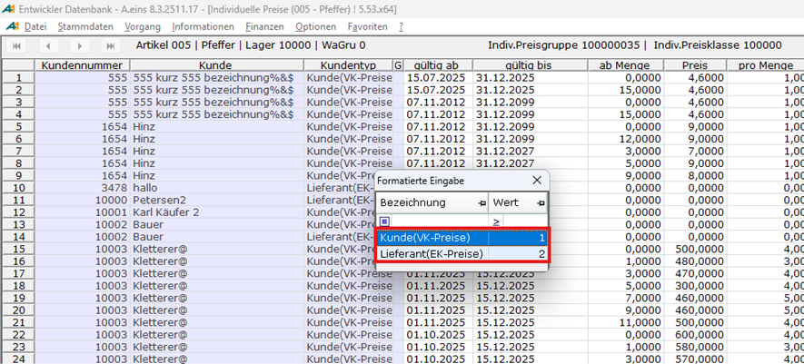
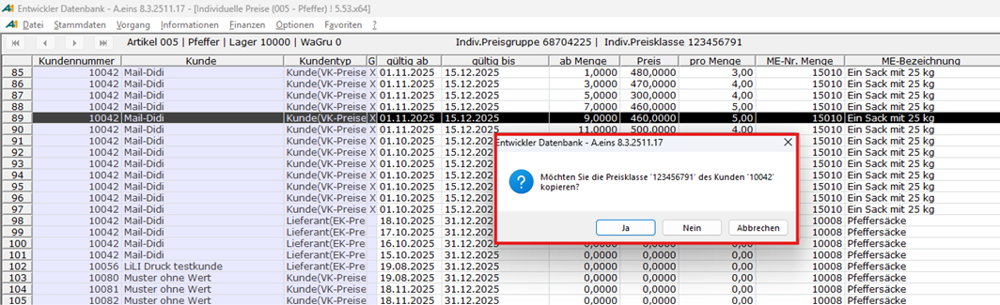

# Hinzufügen eines Kunden

<!-- source: https://amic.de/hilfe/hinzufgeneineskunden.htm -->

Mittels Funktionstaste F8 oder Kontextmenü und Auswahl des Menüeintrags „Kunde/Artikel hinzufügen“ kann in der Artikelsicht ein bislang noch nicht gepflegter Kunde in die Preisstapelpflege einbezogen werden.

Die sich zwecks Kundenauswahl öffnende Dialogbox ist zunächst ungefiltert, bietet aber die Möglichkeit nach Kundennummern zu suchen:

Wurde ein Kontokorrentkunde ausgewählt, muss das System nochmals nachfragen, ob VK- oder EK-Preise anzuwenden sind:

Insofern der gewählte Kunde für die ausgewählte Seite (Einkauf/Verkauf) noch keinen Preisklasseneintrag besitzt, bietet das System die Möglichkeit, die Einträge der aktuell selektierten Preisklasse zu kopieren – aber nur insofern die Seiten passen (Einkauf/Verkauf):

Die erfolgreiche Durchführung der Aktion wird vom System bestätigt.
