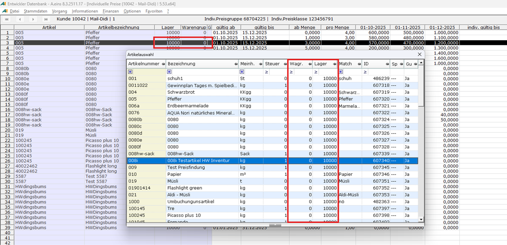

# Hinzufügen eines Artikels

<!-- source: https://amic.de/hilfe/hinzufgeneinesartikels.htm -->

Mittels Funktionstaste F8 oder Kontextmenü und Auswahl des Menüeintrags „Kunde/Artikel hinzufügen“ kann in der Kundensicht ein bislang noch nicht gepflegter Artikel in die Preisstapelpflege einbezogen werden. Die sich zwecks Artikelauswahl öffnende Dialogbox ist hinsichtlich Waren- und Lagergruppennummer vorgefiltert:

Nach Auswahl eines Artikels wird das erfolgreiche Hinzufügen dieses Artikels zum Stapelpfleger bestätigt. Das „gültig ab“ Datum des neuen Eintrags wird auf den Anfang des Geschäftsjahres gelegt, in dem die aktuell angezeigten Preispunkte liegen. Das „gültig bis“ Datum wird standardmäßig auf das Ende des Geschäftsjahres gelegt, in dem der späteste Preispunkt liegt. Werden aktuell keine Preispunkte angezeigt – was technisch möglich ist – wird das „gültig bis“ Datum auf den Wert des gleichlautenden EPA-Parameters gelegt.
