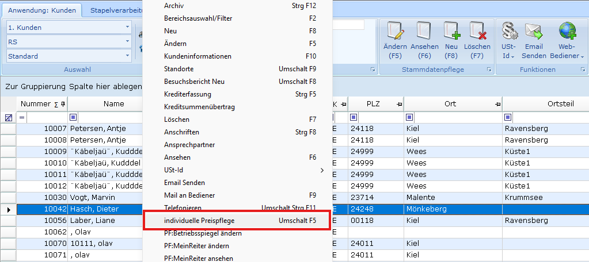
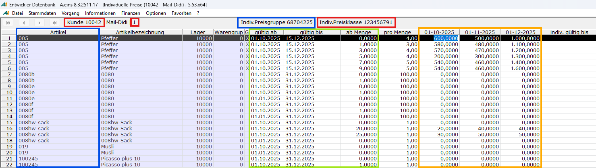

# Aufruf aus Kunden [KU] oder Lieferanten [LI]

<!-- source: https://amic.de/hilfe/aufrufauskundenkuoderlieferant.htm -->

Der Einfachheit halber wird im Folgenden nur von „Kunden“ gesprochen – die Ausführungen gelten analog, wenn mit der Anwendung Lieferanten gestartet wird.

Nach Auswahl eines Kunden kann der Preisstapelpfleger über das Kontextmenü, Menüpunkt „individuelle Preispflege“, oder mit der Tastenkombination Umschalt F5 gestartet werden:

Wie bereits erwähnt, erfolgt die Datenbereitstellung über die Ladeprozedur **HoleIndividuellePreiseKunde**. Die Ergebnismenge wird entsprechend in einem Gitter dargestellt:

Gezeigt werden die Daten des zuvor ausgewählten Kunden „10042“, wir kommen aus der Anwendung KU, also Verkauf „1“. Dieser Kundenseite wurde die individuelle Preisklasse „123456791“ zugewiesen. Sichtbar sind ferner die Verkaufsartikel, gefiltert nach den Attributen „Lager“ und „Warengruppe“. Diesen Artikeln wurde die individuelle Preisgruppe „68704225“ zugewiesen. Am Kreuzungspunkt dieser Dimensionen stehen die eigentlichen individuellen Preisdaten, sortiert nach „gültig ab“, „gültig bis“ und der „ab Menge“. Die Besonderheit des Preisstapelpflegers für die Kundensicht ist die Verwendung **diskreter Preispunkte** – in der aktuellen Ausbaustufe werden maximal drei Stück unterstützt: im obigen Beispiel können Preise ab „01.10.2025“, „01.11.2025“ und schließlich ab „01.12.2025“ gepflegt werden. Zu diesem Zweck muss das gezeigte „gültig ab“ und „gültig bis“ Datum diese Preispunkte umschließen.

Siehe auch:

- [Umfang der bereitgestellten Daten](./umfang_der_bereitgestellten_daten.md)
- [Bedeutung des indiv. Gültig-bis-Feldes](./bedeutung_des_indiv_gueltig_bis_feldes.md)
- [Hinzufügen eines Artikels](./hinzufuegen_eines_artikels.md)
- [Weitere Funktionen des Stapelpflegers aus Kundensicht](./weitere_funktionen_des_stapelpflegers_aus_kundensicht.md)
