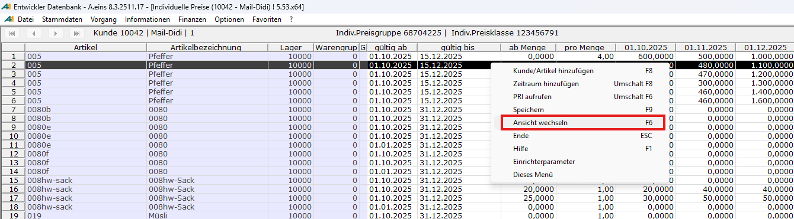
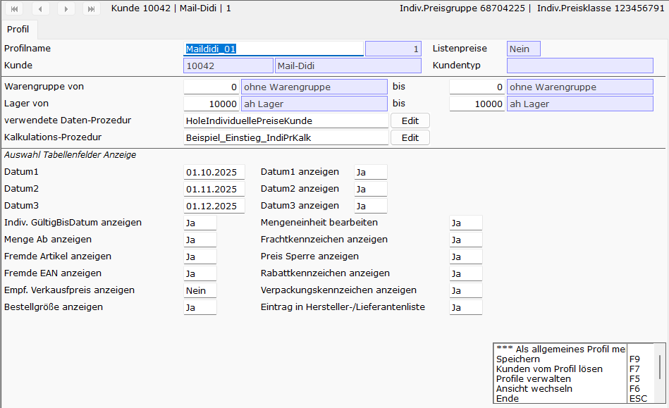

# Preis Profile

<!-- source: https://amic.de/hilfe/_indivPreisProfile.htm -->

Der Umfang der vom Preisstapelpfleger gezeigten Daten kann über ein **Preisprofil** beeinflusst werden. Achtung: in der aktuellen Ausbaustufe des Preisstapelpflegers können Profile nur in der Kundensicht verwendet werden – die Artikelsicht verwendet zurzeit noch ein Standard-Profil ohne weitere Einstellmöglichkeiten. Die Profileinstellungen können aus dem Anwendungsfenster heraus über mehrere Wege erreicht werden: Mausklick auf einen Spaltenkopf, Kontextmenü und Auswahl von „Ansicht wechseln“ oder mittels Funktionstaste F6:

Der Preisprofilpfleger bietet die folgenden Einstellmöglichkeiten, wobei nicht farblich unterlegte Felder aktuell veränderbar sind:

Folgende Parameter stehen zur Auswahl:

| Feld | Beschreibung |
| --- | --- |
| Profilname | Name des für den Kunden gespeicherten Profils. Wurde dem Kunden bislang noch kein Profil zugeordnet, wird Profil „Standard“ gezeigt. |
| Kunde | Kundennummer und Bezeichnung des Kunden. |
| Warengruppe von / bis | F3 Auswahl Von: ab welcher Warengruppe die individuellen Preise bearbeitet werden sollen. Bis: bis zu welcher Warengruppe die individuellen Preise bearbeitet werden sollen. Standardeinstellung ist „0“ ohne Warengruppe |
| Lager von / bis | F3 Auswahl Von: ab welcher Lagernummer sollen Artikel verwendet werden. Bis: bis zu welchem Lager sollen Artikel verwendet werden |
| Verwendete Daten-Prozedur | F3 Auswahl privater Prozeduren Die Prozedur, welche für das Laden der Daten in die Preisbearbeitungsmaske verwendet werden soll. Standard-Prozedur ist die „HoleIndividuellePreiseKunde“. |
| Kalkulations-Prozedur | F3 Auswahl privater Prozeduren Die Prozedur, welche eine Preiskalkulation durchführen kann oder soll. Standard-Prozedur ist die „Beispiel_Einstieg_IndiPrKalk“. |
| Button Edit | Bietet die Möglichkeit zum Bearbeiten der im Feld **Verwendete Prozedur** angegebenen Prozedur. |
| Kalkulations-Prozedur | F3 Auswahl Die Prozedur, welche für die Kalkulation der Preise verwendet werden soll. |
| Button Edit | Bietet die Möglichkeit zum Bearbeiten der im Feld **Kalkulations-Prozedur** angegebenen Prozedur. |
| Datum 1 | Erstes Preisdatum (Voreinstellung ist das aktuelle Tagesdatum) |
| Datum 2 | Zweites Preisdatum (Voreinstellung ist immer der nächste Montag) |
| Datum 3 | Drittes Preisdatum (Voreinstellung ist immer der übernächste Montag) |
| Datum anzeigen | F3 Auswahl mit Ja/Nein Einstellmöglichkeit: die Anzeige des jeweils eingestellten Datums kann unterdrückt werden. |
| Indiv. GültigBisDatum anzeigen | F3 Auswahl mit Ja/Nein Einstellmöglichkeit: Gültig-Bis-Datum des gesamten Bereiches wird verändert. |
| Menge Ab anzeigen | F3 Auswahl mit Ja/Nein Einstellmöglichkeit: aktuell wird dieses Feld ignoriert – AbMenge wird immer angezeigt. |
| Fremde Artikel anzeigen | F3 Auswahl mit Ja/Nein Einstellmöglichkeit: Spalte wird ein- oder ausgeblendet. |
| Fremde EAN anzeigen | F3 Auswahl mit Ja/Nein Einstellmöglichkeit: Spalte wird ein- oder ausgeblendet. |
| Empfohlener Verkaufspreis anzeigen | F3 Auswahl mit Ja/Nein Einstellmöglichkeit: Spalte wird ein- oder ausgeblendet. |
| Bestellgröße anzeigen | F3 Auswahl mit Ja/Nein Einstellmöglichkeit: Spalte wird ein- oder ausgeblendet. |
| Mengeneinheit bearbeiten | F3 Auswahl mit Ja/Nein Einstellmöglichkeit: Spalte wird ein- oder ausgeblendet. |
| Frachtkennzeichen anzeigen | F3 Auswahl mit Ja/Nein Einstellmöglichkeit: Spalte wird ein- oder ausgeblendet. |
| Preis Sperre anzeigen | F3 Auswahl mit Ja/Nein Einstellmöglichkeit: Spalte wird ein- oder ausgeblendet. |
| Rabattkennzeichen anzeigen | F3 Auswahl mit Ja/Nein Einstellmöglichkeit: Spalte wird ein- oder ausgeblendet. |
| Verpackungskennzeichen anzeigen | F3 Auswahl mit Ja/Nein Einstellmöglichkeit: Spalte wird ein- oder ausgeblendet. |

Hiermit ist es möglich, für verschiedene Kunden Profile einzurichten, welche die Steuerung und Anzeige der individuellen Preise und deren Pflege regelt.

Wird beim Start der Anwendung kein Profil zu dem oder den ausgewählten Kunden/Lieferanten gefunden, und es existiert noch kein allgemein gültiges Profil, so stellt das Programm ein Standardprofil zur Verfügung. Dieses Profil ist nicht änderbar und kann weder gespeichert noch als allgemein gültiges Profil gemerkt werden. Geben Sie einfach einen neuen Begriff im Feld **Profilname** ein. Anschließend werden die benötigten Felder zur Bearbeitung freigegeben.

Ein allgemein gültiges Profil wird nicht zu einen oder mehreren Kunden/Lieferanten zugeordnet. Es ist ersetzt das Standardprofil und wird immer für Kunden/Lieferanten verwendet, die noch keine Profilzuordnung besitzen.

Es gibt verschiedene Einstellungsmöglichkeiten, mit denen man die Informationen in der Tabelle des Startbildschirms der Anwendung steuern kann. Einzelheiten finden Sie in der o.a. Tabelle.

**Funktionen**

- Hilfe F1: Öffnet die Hilfe zur Verwendung und Bearbeitung der Profile aus Auswahlliste Kunden
- Als allgemein gültiges Profil merken: merkt sich den gegenwärtig im Feld Profilname angegeben Wert als nicht zugeordnetes Profil zur Verwendung aller anderen Kunden/Lieferanten ohne eigener Profilzuordnung
- Speichern F9: Speichert die Änderungen dieser Ansicht
- Kunden vom Profil lösen F7: löst den aktuellen Kunden von den Profilen. Wird der Kunde erneut mit der Anwendung Individuelle Preise verwendet, so wird für ihn das Standardprofil geladen.
- Ansicht wechseln F6: wechselt Maskenansicht hin zur Tabellenansicht der Artikel
- Ende ESC: verlassen der Anwendung Individuelle Preise
