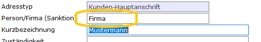
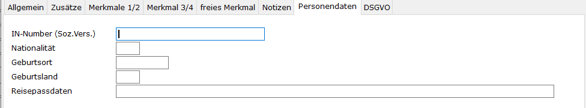

# Stammdatenpflege

<!-- source: https://amic.de/hilfe/_stammdatenpflege.htm -->

Zunächst müssen Sie die bestehenden Anschriften bearbeiten. Es ist eine Unterscheidung notwendig, ob es sich bei der Anschrift um eine Person oder um eine Firma/Organisation handelt. Setzen Sie dazu im Anschriftenstammpfleger das Kennzeichen Person/Firma.

Handelt es sich bei der Anschrift um eine Person, so kann es sinnvoll sein, bei Auslandskontakten weitere Daten wie z.B. die Sozialversicherungsnummer oder Reisepassdaten, Geburtsdaten etc. abzufragen.

Diese Daten sind streng vertraulich, und deshalb auch nur einem eingeschränkten Personenkreis zugänglich.
