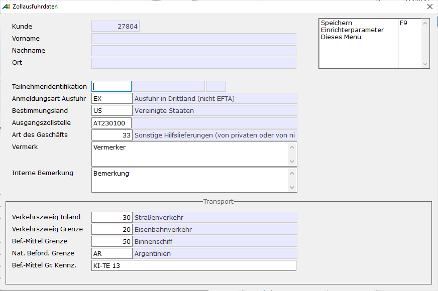

# Zolldaten (Anschriften)

<!-- source: https://amic.de/hilfe/_zolldatenanschriften.htm -->

Die Funktion Zolldaten erscheint nur dann, wenn es sich bei der angegeben Adresse um eine Adresse außerhalb der EU handelt. Um festzustellen, ob es sich dabei um eine Nicht-EU-Adresse handelt, wird die Relation StaatStamm zur Rate gezogen. Ist hier bei der Zollgruppe das Kennzeichen 3 (Drittland) oder 4 (EFTA-Land) eingetragen, wird die Funktion und damit die Bearbeitung der Zolldaten für diese Anschrift sichtbar gemacht. Pflegbar ist der Staatstamm über den Direktsprung „STAAT“.

Bei diesen Daten handelt es sich um eine Vorauswahl einiger, für eine Ausfuhranmeldung, erforderlicher Daten. Diese Daten sind nicht zwingend für eine für den Kunden bestimmte Ausfuhr. Bei einer Ausfuhr selbst besteht jederzeit die Möglichkeit diese vorausgewählten Daten zu verändern.

  <table>
    <tbody>
      <tr>
        <td></td>
        <td></td>
      </tr>
      <tr>
        <td>
          
Anmeldungsart Ausfuhr:

        </td>
        <td>
          
Hierbei handelt es sich um die Art der Ausfuhr. Unterschieden wird hier zwischen Ausfuhr in Drittland (EX) und Ausfuhr in ein EFTA-Land (EU). Dieses Feld wird vorbelegt über den Staatstamm. Je nachdem ob es sich bei der Nationalität der Adresse um ein Dritt- oder EFTA-Land handelt.

        </td>
      </tr>
      <tr>
        <td>
          
Bestimmungsland:

        </td>
        <td>
          
Land in welches die Ausfuhr stattfinden soll. Vorbelegt durch die Nationalität der Adresse.

        </td>
      </tr>
      <tr>
        <td>
          
Beförderungsmittel Inland/Verkehr:

        </td>
        <td>
          
Verkehrszweig, welcher für den Transport der Ware im Inland verwendet wird.

        </td>
      </tr>
      <tr>
        <td>
          
Beförderungsmittel Grenze/Verkehr:

        </td>
        <td>
          
Verkehrszweig, welcher für den Transport der Ware ab dem Überschreiten einer EU-Grenze verwendet wird.

        </td>
      </tr>
      <tr>
        <td>
          
Beförderungsmittel Grenze/Art:

        </td>
        <td>
          
Art des Beförderungsmittels, welches für den Transport der Ware ab dem Überschreiten einer EU-Grenze verwendet wird.

        </td>
      </tr>
      <tr>
        <td>
          
Beförderungsmittel Grenze/Staat:

        </td>
        <td>
          
Nationalität des Beförderungsmittels, welches für den Transport der Ware ab dem Überschreiten einer EU-Grenze verwendet wird.

        </td>
      </tr>
      <tr>
        <td>
          
Beförderungsmittel Grenze/KEZ:

        </td>
        <td>
          
Kennzeichen des Beförderungsmittels, welches für den Transport der Ware ab dem Überschreiten einer EU-Grenze verwendet wird.

        </td>
      </tr>
      <tr>
        <td>
          
Ausfuhrzollstelle:

        </td>
        <td>
          
Deutsche Zollstelle, welche den Transport der Ware verwaltet.

        </td>
      </tr>
      <tr>
        <td>
          
Ausgangszollstelle:

        </td>
        <td>
          
Zollstelle, über welche die Ware die EU verlässt.

        </td>
      </tr>
      <tr>
        <td>
          
Art des Geschäfts:

        </td>
        <td>
          
Art des Geschäfts welcher die Ausfuhranmeldungen zugrunde liegen.

        </td>
      </tr>
      <tr>
        <td>
          
Teilnehmeridentifikation:

        </td>
        <td>
          
Teilnehmeridentifikation (TIN) des Empfängers der Ausfuhr.

        </td>
      </tr>
      <tr>
        <td>
          
Deutsche Identifikation:

        </td>
        <td>
          
Angabe ob es sich bei der angegeben TIN um eine deutsche TIN handelt.

        </td>
      </tr>
      <tr>
        <td>
          
Vermerk Ausfuhr:

        </td>
        <td>
          
Vermerk zur Ausfuhr. Wird an die Zollverwaltung übertragen, hat aber keine direkte zollrechtliche Auswirkung.

        </td>
      </tr>
      <tr>
        <td>
          
Bemerkung Ausfuhr:

        </td>
        <td>
          
Interne Bemerkung zur Ausfuhr. Wird nicht an die Zollverwaltung versendet.

        </td>
      </tr>
    </tbody>
  </table>

