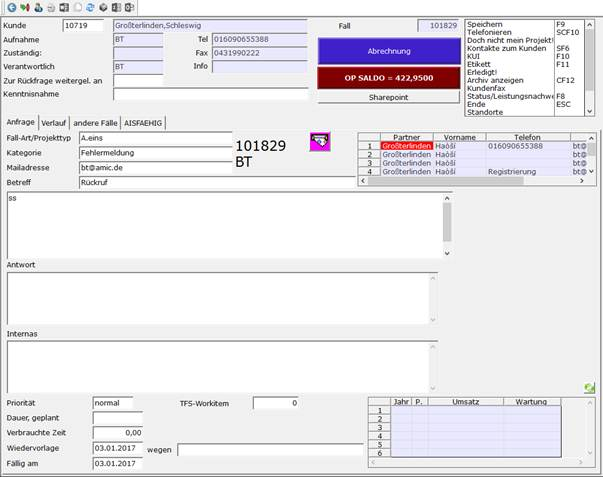

# Projektverwaltung

<!-- source: https://amic.de/hilfe/projektverwaltung.htm -->

Hauptmenü > Stammdatenpflege > Projektverwaltung

Innerhalb A.eins kann per Direktsprung HL zu jedem Kunden eine Projektverwaltung mit beliebig vielen Projekten eingerichtet und verwaltet werden.

Basis der Projektverwaltung ist der Verwaltungsbildschirm:

Zu jedem Projekt wird eine Fallnummer angelegt, in der verschiedene Informationen bearbeitet werden können.

Siehe auch:

- [Abrechnung](./abrechnung.md)
- [OP Saldo](./op_saldo.md)
- [Mailverkehr](./mailverkehr.md)
- [Ansprechpartner](./ansprechpartner.md)
- [Kundenauswahl](./kundenauswahl.md)
