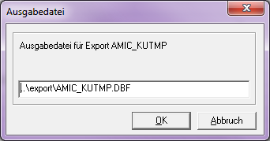

# Stammdatenexport (Kunden)

<!-- source: https://amic.de/hilfe/_stammdatenexportkund.htm -->

Hauptmenü > Externe Kommunikation > Stammdatenimport > Stammdatenexport  
Variante „Ansicht für Stammdatenexport (Kunden)“

In dieser Variante sieht man Felder die über die View AMIC_StammImportExportKunden zusammengetragen werden.

Mit Hilfe der Funktion ***Export Kunden*** **F9** können die Kundenstammdaten exportiert werden. Nach Bestätigung einer Abfrage, ob man den Export der ausgewählten Kunden durchführen möchte, erscheint ein Fenster, in dem der Pfad und die Ausgabedatei angegeben werden können.  
Der Standardvorschlag für den Pfad ist das Export-Verzeichnis von A.eins und der Dateiname wird mit AMIC_KUTMP.DBF vorbelegt.

