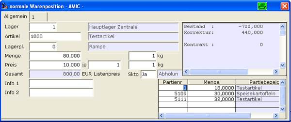

# Standardablauf

<!-- source: https://amic.de/hilfe/_standardablauf.htm -->

Nach der Eingabe der Menge wird (sofern unter **[FRZ]** eingestellt, siehe später unter Parameter der Partiezuordnung!) eine automatische Partiesuche durchgeführt. Wurde mindestens eine passende Partie gefunden, so wird das Partiefenster automatisch aufgeblendet und die zugeordneten Partien werden angezeigt. Der Eingabefokus steht dann auf der ersten Partienummer:

Die ENTER ( Return ) Taste in der Spalte Partienummer ohne Änderung an der Partienummer wird immer als Bestätigung aufgefasst und bewirkt, dass wieder zur ‚normalen’ Warenerfassung zurückgesprungen wird.

Durch TAB oder Pfeiltasten kann in den Feldern navigiert werden. Durch die Eingabe einer Partienummer in einer leeren Zeile wird die noch verbliebene Differenz zur Gesamtmenge der Warenposition vorbelegt.
