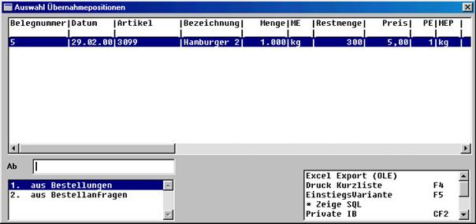
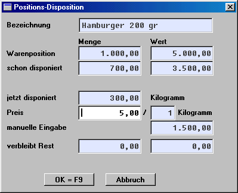
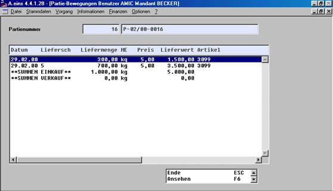

# Partie und Teildisposition

<!-- source: https://amic.de/hilfe/_partieundteildisposi.htm -->

Hauptmenü > Wareneinkauf > Bestellung > Bestellungen bearbeiten

oder Direktsprung **[ELB]**

Nachfolgend wird beschrieben, wie Partien bei einer Teildisposition (Übernahme einer Teilmenge aus der Vorstufe (z.B. Bestellung)) bebucht werden.

Bei Erfassung der Bestellung (Nr.5) wurde die Partie (Nr. 16) neu angelegt. Bei der Erfassung des Eingangslieferscheines wird, im Positionsbereich mit der Funktion ***Teildisposition*** **F6**, eine Auswahl aller nicht erledigten Bestellungen für diesen Lieferanten angezeigt.

Nach Auswahl der Bestellung wird die gesamte Positionsmenge übernommen und kann an dieser Stelle nicht korrigiert werden. Es besteht lediglich Einfluss auf den Preis.

Nachdem diese Maske mit **F9** übernommen wurde, ist die Position der Bestellung in den Eingangslieferschein übernommen. Somit ist auch die Partiezuordnung der Bestellung in den Eingangslieferschein übernommen. Über die Funktion **Korrektur Zeile** **F5** kann nun die Menge und die Partie dieser Eingangslieferscheinposition abgeändert werden.

Bei Betrachtung der Partie wird deutlich, dass im Einkauf 1000 kg disponiert wurden und bereits 700 kg mit dem Eingangslieferschein Nr. 5 eingetroffen sind.

