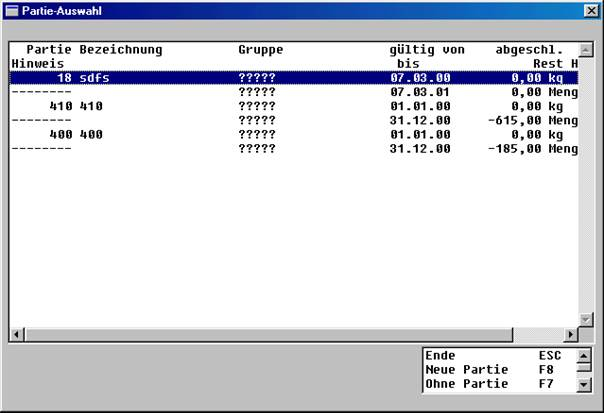

# Partiebewegung im Einkauf und im Verkauf

<!-- source: https://amic.de/hilfe/_partiebewegungimeink.htm -->

Bei der Erfassung einer Bestellung/Auftrag, eines Eingangs-/ Ausgangslieferscheines oder einer Eingangs-/ Ausgangsrechnung kann je nach SPA-Einstellung einer Artikelposition eine Partie zugeordnet werden. In der Positionserfassungsmaske, nach Erfassung der Artikelmengen und der Mengeneinheit wird entweder automatisch das Partieauswahlfenster geöffnet (SPA 20,21) oder in der Optionbox die Funktion ***Partieauswahl*** **CF7** bereitgestellt.

Die Darstellung dieser Partieauswahl wird über SPA 10 und SPA 23 gesteuert. Durch Auswahl mit der Maus oder den Pfeiltasten kann eine Partie angesteuert und mit RETURN (Enter) dieser Position zugeordnet werden.

 **ESC**: Abbruch der Partieauswahl

 **F8**: Anlegen einer neuen Partie (siehe 9.2.1.)

 **F7**: dieser Position wird keine Partie zugeordnet
