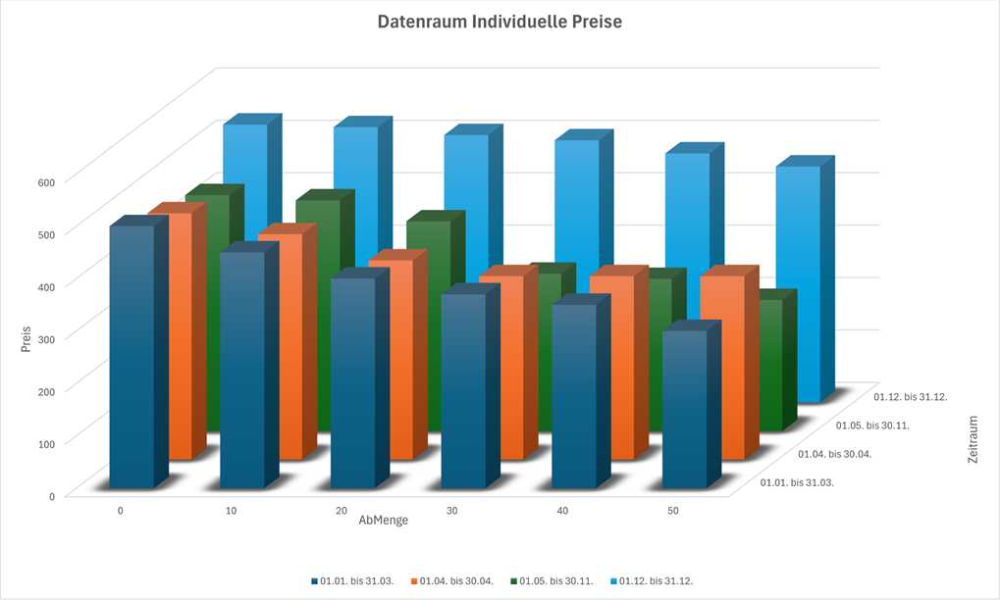

# Individuelle Preise

<!-- source: https://amic.de/hilfe/_indivPreise.htm -->

Ein individueller Preis eines Artikels für einen Kunden oder von einem Lieferanten wird durch die Angabe einer individuellen Preisgruppe im Artikel und einer individuellen Preisklasse im Kunden-/Lieferantenstamm jeweils im Einkauf bzw. Verkauf zugeordnet. Für die dadurch festgelegte Gruppen-Klassen-Kombination wird ein Preis oder eine mengenabhängige Preisstaffel gepflegt. Diese Preisangaben werden zusätzlich über einen Gültigkeitszeitraum (Ab-Datum, Bis-Datum) qualifiziert. Der Datenraum individueller Preise ist quasi ein Würfel mit den Dimensionen **Ab-Menge**, **Ab-Datum** und **Preis**:

Die weiteren Dimensionen sind (oben nicht dargestellt) der **Artikel** (ausgedrückt über die individuelle Preisgruppe) und der **Kunde** (ausgedrückt über die individuelle Preisklasse).

Die Pflege der individuellen Preise folgt diesem Dimensionenkonzept: werden die Dimensionen Preisgruppe **und** Preisklasse fixiert, gelangt man zum [Einzelsatzpfleger](../pflegefunktion_fuer_rabatte_zu_abschlaege_individuelle_preis/index.md) für individuelle Preise/Rabatte im Verkauf <strong>[PRI]</strong> und Einkauf **[PRIE]**, wird eine der fixierten Dimensionen **freigegeben** (Preisgruppe frei → Artikel frei wählbar → Einstieg über den festen Kunden/Lieferanten oder Preisklasse frei → Kunde frei wählbar → Einstieg über den festen Artikel) benötigt man den sogenannten [Preisstapelpfleger](../../kunden_und_lieferanten/kunden_und_lieferantenstamm/individuelle_preise/index.md) für individuelle Preise.

Siehe auch:

- [Individuelle Preisklasse](./individuelle_preisklasse.md)
- [Individuelle Preisgruppe](./individuelle_preisgruppe.md)
