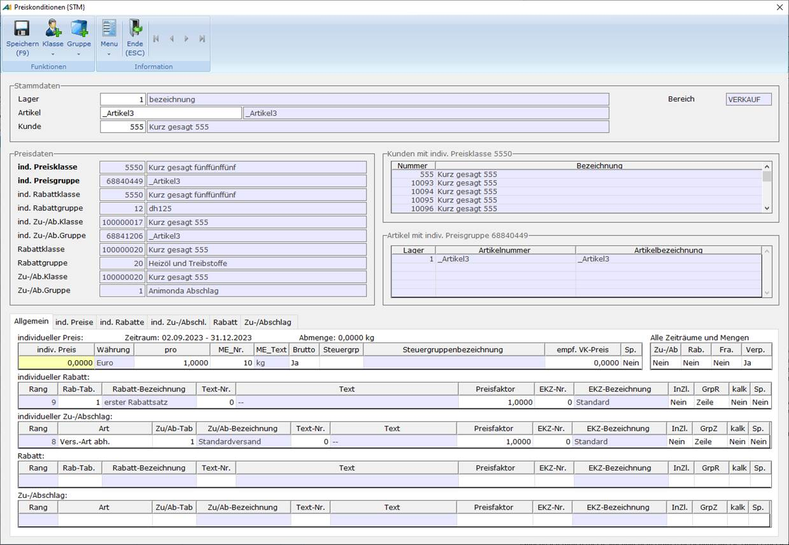

# Pflegefunktion für Rabatte, Zu-/Abschläge, individuelle Preise, Individuelle Rabatte und individuelle Zu-/Abschläge

<!-- source: https://amic.de/hilfe/_PFLMODUL_IPRRAB.htm -->

Preise / Konditionen > Rabatte > allgemeine Rabatte **[RAV]**

Preise / Konditionen > Zu- und Abschläge > allgemeine Zu-/Abschläge **[ZAVA]**

Preise / Konditionen > Individualvereinbarungen > individuelle Preise/Rabatte VK **[PRI]**

Preise / Konditionen > Individualvereinbarungen > individuelle Preise/Rabatte EK **[PRIE]**

Preise / Konditionen > Individualvereinbarungen > Individualpreise bearbeiten **[PI]**

Preise / Konditionen > Individualvereinbarungen > individuelle Rabatte VK **[RAI]**

Preise / Konditionen > Individualvereinbarungen > individuelle Rabatte EK **[RAIEK]**

Preise / Konditionen > Individualvereinbarungen > individueller Zu-/Abschlag VK **[ZAI]**

Preise / Konditionen > Individualvereinbarungen > individueller Zu-/Abschlag EK **[ZAIEK]**

Die Pflege von individuellen Preisen, individuellen Rabatten, individuellen Zu-/Abschlägen, Rabatten und Zu/-Abschlägen erfolgt über den Pfleger Preiskonditionen. Hierbei muss jeweils Einkauf und Verkauf unterschieden werden.

­

Die Pflege erfolgt in allen fünf Bereichen jeweils über die Kombination einer Klasse und einer Gruppe. Die Klassen können hierbei im Kundenstamm hinterlegt werden, die Gruppen im Artikel.

Die Auswahl eines Kunden bzw. eines Artikels (mit Lagernummer) dient hierbei der schnellauswahl für die entsprechenden Klassen/Gruppen. Wenn kein Kunde/Artikel ausgewählt ist, können aber auch die Klassen/Gruppen direkt ausgewählt werden.

Wenn ein ausgewählter Kunde (bzw. ausgewählter Artikel) noch nicht alle Klassen (Gruppen) zugeordnet hat, kann über eine Optionboxfunktion eine neue Klasse (Gruppe) angelegt werden, welche dem Kunden (Artikel) direkt zugeordnet wird.

Da jede Klasse (Gruppe) auch mehreren Kunden (Artikel) zugeordnet sein kann, sieht man im rechten Bereich nochmal alle beteiligten Kunden (Artikel), welche von der aktuellen Pflege betroffen sind. Es wird also nicht nur der oben ausgewählte Kunde (Artikel) gepflegt, sondern alle Kunden (Artikel) mit der entsprechenden Klasse (Gruppe).

Siehe auch:

- [Tab: Allgemein](./tab_allgemein.md)
- [Tab individuelle Preise](./tab_individuelle_preise.md)
- [(Individuelle) Rabatte](./individuelle_rabatte.md)
- [(Individuelle) Zu-/Abschläge](./individuelle_zu_abschlaege.md)
