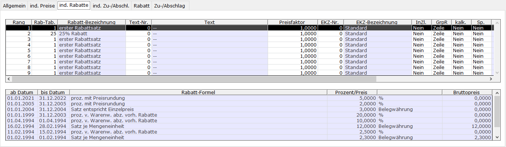

# (Individuelle) Rabatte

<!-- source: https://amic.de/hilfe/_indivRab_Pflege.htm -->

Allgemeine Hinweise zum Aufruf und zur Arbeitsweise des Moduls sind [hier](./index.md) zu finden.

| Spalte | **Erklärung** |
| --- | --- |
| Rang | Sortierung bei mehreren Rabatten. Wird dieser rausgenommen, kann der Rabatt entfernt werden.  |
| Rabatt-Tabelle | Nummer der Rabatttabelle. In dieser sind die eigentlichen Rabatte zeitbezogen hinterlegt.  |
| Rabatt-Bezeichnung | Bezeichnung der Rabatttabelle  |
| Text-Nr. | Text der beispielsweise im Formular eingerichtet werden kann.  |
| Text | Text, der zur Text-Nr. hinterlegt ist. Wenn ein Text mit einem \* versehen ist, ist dieser nicht in der Hauptsprache eingerichtet.  |
| Preisfaktor | Menge auf die sich der Rabatt bezieht. Nicht bei %-Rabatten relevant.  |
| EKZ-Nr. (Erlöskennziffer) | Nummer der Erlöskennziffer beim Ziehen des Rabattes. Wenn eine 0 eingetragen wird, wird die Erlöskennziffer des Artikels gezogen.  |
| EKZ-Bezeichnung | Bezeichnung der ausgewählten EKZ-Nummer  |
| InZl. (In Zeile) | Kennzeichen, ob der Rabatt in der Artikelzeile oder als eigene Zeile erzeugt werden soll.  |
| GrpR (Gruppenrabatt) | Kennzeichen, ob es sich hierbei um einen Gruppenrabatt handelt.  |
| kalk. (Kalkulationskennzeichen) | Kennzeichen, ob es sich um einen kalkulatorischen Rabatt handelt, ob dieser also direkt im Preis enthalten ist.  |
| Sp. (Sperrkennzeichen) | Möglichkeit der (vorübergehenden) Sperrung des Rabattes.  |
| Schlüssel | Steuerschlüssel, hinterlegt im Rabattsatz. Wenn eine 0 eingetragen wird, wird der Steuerschlüssel der Warenposition gezogen). Sichtbar in Abhängigkeit von Steuerparameter 329 („Separate Steuer auf Rabatte möglich“)  |
| Schlüssel-Bezeichnung | Bezeichnung des Steuerschlüssels. Sichtbar in Abhängigkeit von Steuerparameter 329 („Separate Steuer auf Rabatte möglich“)  |

Die untere Tabelle bezieht sich immer auf die in der oberen Tabelle ausgewählte Zeile und enthält die Informationen zur ausgewählten Rabatttabelle.

| Spalte | **Erklärung** |
| --- | --- |
| ab Datum | Beginn des jeweiligen Gültigkeitszeitraumes des Rabattsatzes. Bei Überschneidungen wird das größere ab-Datum berücksichtigt  |
| bis Datum | Ende des jeweiligen Gültigkeitszeitraumes des Rabattsatzes.  |
| Rabatt-Formel | Die Rabattformel bestimmt zusammen mit der Wertangabe (Prozent/Preis) die Art der Rabattermittlung  |
| Prozent/Preis | Preis bzw. Prozentsatz des Rabattes.  |
| (Bezug) | % oder Belegwährung oder feste Währung (Kombination aus Rabattformel, Steuerparameter 363 („Währungsbehandlung ZuAbschl. etc Ware“) und 361 („Währungsnummer für ZuAbschläge etc. Ware“)  |
| Bruttopreis | Wert für Bruttobelege bei nichtprozentualem Satz. Bei Wert 0 errechnet sich dieser aus Netto- und Steuersatz  |
