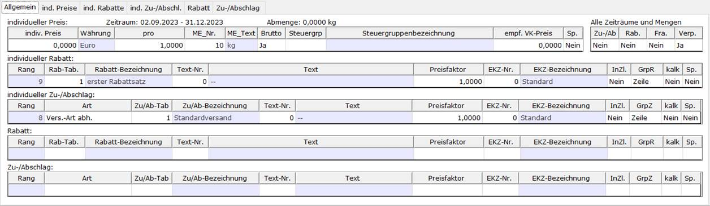

# Tab: Allgemein

<!-- source: https://amic.de/hilfe/_allgemeinPreiskond_Pflege.htm -->

Allgemeine Hinweise zum Aufruf und zur Arbeitsweise des Moduls sind [hier](./index.md) zu finden.

Der Tabreiter „Allgemein“ ist eine Art Schnellerfassung, die die aktuellen individuellen Preise, (individuelle) Rabatte und (individuelle) Zu-/Abschläge auf einen Blick darstellt. Die einzelnen Blöcke sind nur zu sehen, wenn die zugehörige Klasse und Gruppe ungleich Null sind.

**Individueller Preis**

Hier wird der aktuelle Individualpreis angezeigt. Bei einer hinterlegten Mengenstaffelung auf dem Reiter „ind. Preise“ wird immer der Preis ab Menge 0 angezeigt.

Ist kein aktueller Individualpreis angelgt, kann man diesen hier eintragen, die Vorbelegung für die Datumsgrenzen werden aus den Einrichterparametern herangezogen. Sollte das Tagesdatum außerhalb dieses Zeitraums liegen, wird sich das Grid bei verlassen und wieder betreten des Reiters leeren, da es sich nicht um einen aktuellen Individualpreis handelt. Auf dem Reiter „ind. Preise“ ist dann der Eintrag für diese Datumsgrenzen vorhanden.

Das Feld Brutto wird aus dem Feld Bruttorechnung aus dem Kundenstamm - Register „Kennzeichen“ - vorbelegt.

Für die Beschreibung der Einzelfelder vergleich Tabreiter „ind. Preise“.

**(Individueller) Rabatt**

Hier wird der (individuelle) Rabatt mit dem höchsten Rang angezeigt.

Für die Beschreibung der Einzelfelder vergleich Tabreiter „ind. Rabatt“/“Rabatt“.

**(Individueller) Zu-/Abschlag**

Hier wird der (individuelle) Zu-/Abschlag mit dem höchsten Rang angezeigt.

Für die Beschreibung der Einzelfelder vergleich Tabreiter „ind. Zu-/Abschlag“/“ Zu-/Abschlag“.
