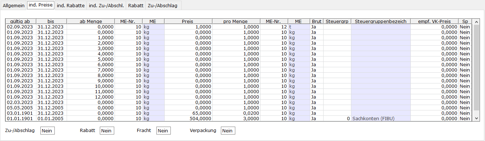

# Tab individuelle Preise

<!-- source: https://amic.de/hilfe/_indivPreis_Pflege.htm -->

Allgemeine Hinweise zum Aufruf und zur Arbeitsweise des Moduls sind [hier](./index.md) zu finden.

Die Sortierung der Tabelle lässt sich in den Einrichterparametern hinterlegen. Einige Felder müssen für das gleiche Gültig-Ab Datum identisch sein. In diesen Fällen kann das Feld nur in der Zeile mit Menge 0 gepflegt werden. Die anderen Zeilen werden bei einer Änderung automatisch mit angepasst.

| Spalte | **Erklärung** |
| --- | --- |
| gültig ab | Gültig-Ab Datum des Indivivdualpreises. Sollte das aktuelle Datum in mehr als einem Zeitraum enthalten sein, wird immer der Preis mit dem größten Gültig-Ab Datum herangezogen. Die Vorbelegung lässt sich in den Einrichterparametern pflegen. Entfernt man das Datum kommt eine Abfrage, ob alle Einträge mit diesem Ab-Datum entfernt werden sollen. Bei Bestätigung werden die Zeilen entfernt. Gelöscht werden sie aber erst beim Speichern.  |
| bis | Gültig-Bis Datum des Individualpreises. Muss für alle Einträge mit dem gleichen Gültig-Ab Datum identisch sein. Die Vorbelegung lässt sich in den Einrichterparametern pflegen.  |
| ab Menge | Menge ab der der Individualpreis gezogen wird. Es muss immer ein Eintrag mit Menge 0 existieren.  |
| ME-Nr. / ME | Mengeneinheitsnummer und Bezeichnung der ab-Menge. Muss für alle Einträge mit dem gleichen Gültig-Ab Datum identisch sein.  |
| Preis | Individualpreis  |
| pro Menge | Für diese Menge gilt der Preis. z.B. letzte Zeile 504€ pro 3kg des Artikels  |
| ME-Nr. / ME | Mengeneinheitsnummer und Bezeichnung der pro-Menge. Muss für alle Einträge mit dem gleichen Gültig-Ab Datum identisch sein.  |
| Brut (Brutto) | Es handelt sich um einen Bruttopreis. Das Feld kann nur für den ersten Eintrag eines Preiszeitraums – gekennzeichnet durch „ab Menge“ 0,00 – geändert werden. Es wird dann für den gesamten Zeitraum geändert.  |
| Steuergruppe/Steuergruppenbezeichnung | Bei einem Bruttopreis kann hier eine abweichende Steuergruppe hinterlegt werden. Muss für alle Einträge mit dem gleichen Gültig-Ab Datum identisch sein.  |
| Empf. VK-Preis | Enthält Zusatzangaben, die beispielhaft angedruckt werden können.  |
| Sp (Sperrkennzeichen) | Möglichkeit der (vorübergehenden) Sperrung des Individualpreises.  |

| Feld | **Erklärung** |
| --- | --- |
| Zu-/Abschlag | Einstellung, ob Zu-/Abschlägen trotz Individualpreises gezogen werden sollen. Die Einstellung gilt für alle Einträge unabhängig von Ab-Datum und Ab-Menge  |
| Rabatt | Einstellung, ob Rabatte trotz Individualpreises gezogen werden sollen. Die Einstellung gilt für alle Einträge unabhängig von Ab-Datum und Ab-Menge  |
| Fracht | Einstellung, ob Frachten trotz Individualpreises gezogen werden sollen. Die Einstellung gilt für alle Einträge unabhängig von Ab-Datum und Ab-Menge  |
| Verpackung | Einstellung, ob Verpackungskosten trotz Individualpreises gezogen werden sollen. Die Einstellung gilt für alle Einträge unabhängig von Ab-Datum und Ab-Menge  |
