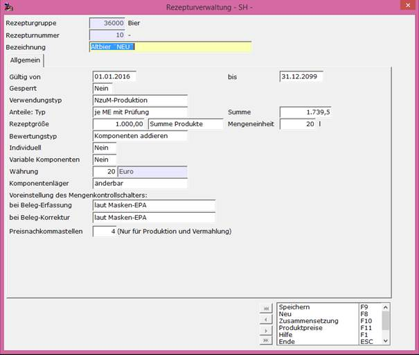
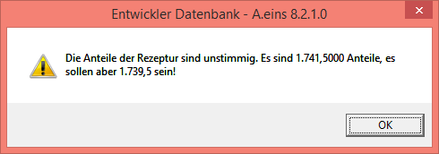
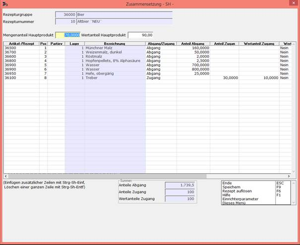
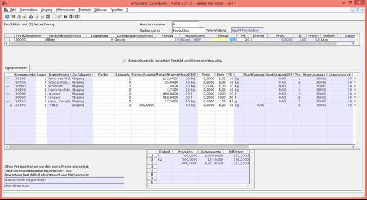
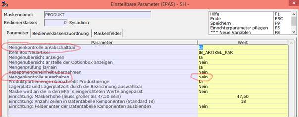

# Beispiel 2 für NzuM-Produktion:

<!-- source: https://amic.de/hilfe/beispiel2frnzumproduktion.htm -->

Anlegen eines Rezeptes zur Rezepturgruppe 36000 mit Rezepturnummer 10 unter **[REZ]** :

Für den Verwendungstyp wurde NzuM-Produktion gewählt.  
Anteile Typ wurde auf ‚je ME mit Prüfung‘ gesetzt, dass heißt das bei der Zusammensetzung des Rezeptes eine Prüfung der Summe der Komponenten stattfindet.  
Die Rezeptgröße von 1000 Litern bezieht sich auf die Summe der Produkte.  
    

Unter **Zusammensetzung F10** können danach die Komponenten für das Rezept 10 eingegeben werden. In unserem Beispiel ergibt die Summe der Anteile des Hauptproduktes 1739,5. Dies wird hier vom System geprüft, da für den Anteile: Typ ‚je ME mit Prüfung‘ angegeben wurde. Gibt man in der Summe zu wenig oder zu viele Anteile für die Komponenten des Hauptproduktes an erscheint beim Speichern oder Verlassen der Maske eine Hinweis-Meldung.

    
Der Mengenanteil des Hauptproduktes wird hier mit 70 angegeben. Für den Treber ist ein Mengenanteil von 30 in der Spalte ‚Anteil Zugang‘ angegeben.

Unter **[PROE]** wird die Produktion nun erfasst.

Der Positionsteil sieht wie folgt aus:

Unter Produktnummer ist die Rezepturgruppe (36000) angegeben und unter Rezept wählt man die entsprechende Rezeptur aus, in diesem Fall das Rezept 10.  
Dann gibt man noch die Menge an, die man produzieren will. In diesem Fall sind es 700 Liter (von dem Hauptprodukt).

Da im Rezept eine Rezeptgröße von 1000 Litern für die Summe der Produkte angegeben war, bleibt dann für den Treber noch 300 über. Die Mengen für das Feld ‚Menge Abgang‘ der einzelnen Komponenten berechnen sich dann aus dem Feld ‚Anteil Abgang‘ aus dem Rezept geteilt durch die Rezeptgröße (1000) multipliziert mit der zu produzierenden Menge (700).

Der Bildschirmabzug wurde unter **[PROB]** erstellt.

Die Voreinstellung für die Mengenkontrolle steht hier auf aktiv, so wie es im Rezept 10 für die Beleg-Korrektur angegeben wurde. Dort stand laut Masken-EPA. Schaut man in die Einrichterparameter dieser Maske sieht man, dass die Mengenkontrolle hier angeschaltet ist.

In der Gegenzeile (markiert mit G in der ersten Spalte) findet man in der NzuM-Produktion die Nebenprodukte im Zugang.
