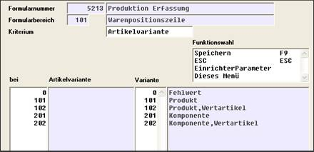
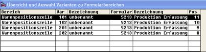
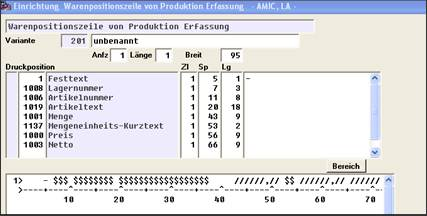

# Rücklieferung in Stückliste

<!-- source: https://amic.de/hilfe/_rcklieferunginstckli.htm -->

Bei der Rücklieferung eines Stücklistenartikels tritt inhaltlich das Problem auf, dass das erzeugte Produkt nicht wieder in seine Komponenten zerlegt werden kann. In diesem Fall richte man eine zweite Rezeptur ein, welche als Komponente das Produkt mit 100% enthält. Dadurch wird realisiert, dass trotz Verwendung der Stückliste, die Rücklieferung auf das Produkt gebucht wird. Evt. Preis- und Bewertungsabschläge können über den Eintrag einer negativen Wertposition bezogen auf das Produkt realisiert werden.

Die Variantenauswahl kann dann wie folgt erscheinen:

Hier könnte beispielsweise die Komponentenvariante wie folgt eingerichtet sein:

