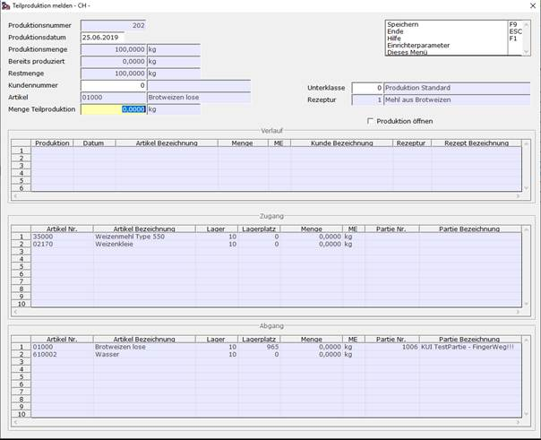

# Teilproduktion

<!-- source: https://amic.de/hilfe/_teilprod.htm -->

#### Startbedingungen

Die Funktionalität der Teilproduktion ist sowohl von einem Produktionsauftrag, wie auch von einem Produktionsangebot aus möglich. Der Auftrag (bzw. das Angebot) muss folgende Kriterien erfüllen:

- Der Beleg darf nur eine Produktionsposition enthalten.
- Pro Position ist maximal eine Partie eingetragen.
- Es darf nur ein Element ausgewählt sein um es umzuwandeln.
- Die Mengenkontrolle wird **dringend empfohlen**. Ansonsten werden die Komponenten nicht mitkalkuliert.

#### Funktionalität

Ausgehend von einem Produktionsauftrag/-angebot gibt es den Schalter Teilproduktion melden. Es wird die folgende Maske geöffnet.

Hier können nun folgende Felder gepflegt werden:

- Menge: Dies ist die Menge die vom Angebot/Auftrag abgebucht wird. Die Komponenten werden nach der Rezeptur berechnet.
- Produktionskunde
- Unterklasse der erzeugten Produktion
- Auswahlbox-Box: Soll die neue Produktion zum Pflegen direkt geöffnet werden?

Zum Abschließen mit [F9] speichern.

#### Storno

Wird eine per Teilproduktion erzeugte Produktion storniert, so wird diese standardmäßig auf den Auftrag beziehungsweise das Angebot zurückgebucht. Die Rückbuchung geht jedoch nur solange, wie die Ausgangsproduktion (Angebot/Auftrag) noch nicht selbst in eine Produktion umgewandelt wurde.

#### UFLD

Es gibt die Möglichkeit beim Angebot/Auftrag das Buchverhalten einzurichten. Die Optionen sind:

- Rückbuchung beim Storno aktivieren
- Abbuchen vom Auftrag/Angebot aktivieren

Beide sind standardmäßig auf „Ja“ gesetzt. Auf diese Weiße können Musterproduktionen vorerfasst werden welche immer wieder als Basis herangezogen werden können. Hierbei sollte man sich bewusst sein, dass auf Aufträgen Dispobestände geführt werden.
