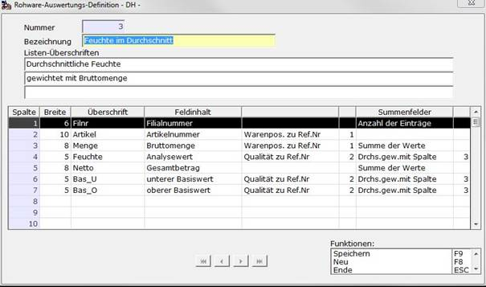

# Auswertungs-Listenfeld-Definition

<!-- source: https://amic.de/hilfe/_rwalisflddef1.htm -->

Hauptmenü > Rohwarenabrechnung > Excel-Kommunikation > RW-Auswert.-Definition

Direktsprung **[RWAD]**

Mit diesem Modul werden Schemata zur Rohware-Excel-Auswertung angelegt, die den Zeilenaufbau von Auswertungen bestimmen und die Behandlung der Spalten bei der Teilsummen-Bildung in Excel festlegen.

In diesem Eingabebildschirm können die nachfolgenden Felder bearbeitet werden.

**Nummer**

laufende Nummer, diese kann im Neu-Fall manuell überschrieben werden

**Bezeichnung**

Ausführliche Bezeichnung des Definitionsschemas.

**Listen-Überschriften**

Hier können Texte für bis zu drei Überschrift-Zeilen für das Excel-Blatt angegeben werden.

**Spalte**

Laufende Nummer der Spalte.

**Breite**

Angaben zur Breite der Spalte und damit auch der darstellbaren Größe der Felder sowie der Spaltenüberschrift.

**Überschrift**

Hier kann ein wahlfreier Text eingegeben werden, der als Spaltenüberschrift genutzt wird.

**Feldinhalt**

Hier können die Felder mit **F3** ausgewählt werden, deren Werte in der Tabelle angezeigt werden sollen. Je nach ausgewähltem Feld-Typ wird eine weitere Auswahlmöglichkeit (Warenpos. zu Ref.Nr. bei Feld Artikelnummer etc.) erwartet. 

**Summenfelder**

Hier kann die Behandlung der Spalte bei der automatischen Teilsummenbildung in Excel ausgewählt werden. Eine Auswahl mit **F3** ist möglich.
