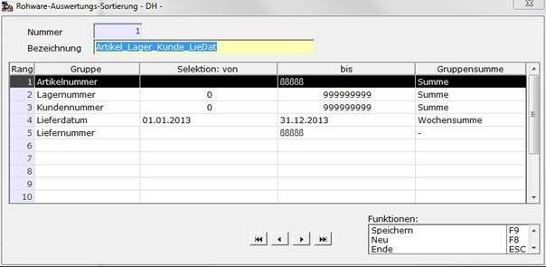

# Auswertungs-Sortier-Definition

<!-- source: https://amic.de/hilfe/__rwalissorfdef1.htm -->

Hauptmenü > Rohwarenabrechnung > Excel-Kommunikation > RW-Ausw.-Sort.Definition

Direktsprung **[RWAS]**

Mit diesem Modul werden Schemata zur Rohware-Excel-Auswertung angelegt, die die Reihenfolge der Datenzeilen und die Teilsummenauslösungskriterien angibt sowie die Vorbelegung der Selektionskriterien bestimmt.

In diesem Eingabebildschirm können die nachfolgenden Felder bearbeitet werden.

**Nummer**

laufende Nummer, diese kann im Neu-Fall manuell überschrieben werden

**Bezeichnung**

Ausführliche Bezeichnung des Sortier-/Selektions-Schemas.

**Rang**

Gruppier-Reihenfolge der Liste. In diesem Beispiel erfolgt die übergeordnete Gruppierung nach Artikelnummer. Erfolgt ein Wechsel der Artikelnummer, so wird bei der Excel-Auswertung eine Teilergebnis-Bildung ausgeführt, wenn ein Gruppensummenkennzeichen angegeben ist. Die untergeordneten Gruppenwechsel werden dann auch mit ausgeführt und die entsprechenden Summen gebildet. Eine Auswahl mit **F3** ist möglich.

**Gruppe**

Das Feld, nach dem innerhalb der Liste gruppiert/sortiert werden soll; dies muss nicht zwingend ein Feld sein, das ein Summenkennzeichen trägt.. So bedeutet ein Wechsel der Liefernummer in diesem Beispiel, dass die Sortierung innerhalb der anderen Gruppierungen nach der Liefernummer erfolgt. Es erfolgt aber keine Teilergebnis-Bildung beim Wechsel der Liefernummer. Eine Auswahl mit **F3** ist möglich.

**Selektion: von bis**

Für die ausgewählten Felder wird hier die Vorbelegung für die Selektion der Auswertungen festgelegt.

**Gruppensumme**

Hier kann ausgewählt werden, ob bei Wechsel des Feldwertes bei der Erstellung von Excel-Auswertungen eine Teilergebnisbildung ausgelöst werden soll oder nicht, sowie bei unterschiedlichen Feldtypen, wie z.B. Datumsfelder, ob diese bei Tages-, Wochen- oder Monatswechsel gebildet werden soll, wobei die Auswahlmöglichkeiten je nach Feld-Typ unterschiedlich sein können. In der Regel wird es sich hierbei jedoch um Summe oder - (keine Summe) handeln. Eine Auswahl mit **F3** ist möglich.
