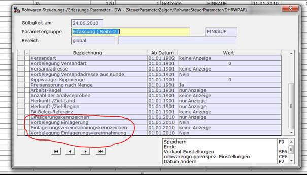

# Einrichtung in den Rohwareparametern

<!-- source: https://amic.de/hilfe/einrichtungindenrohwareparamet.htm -->

Hauptmenü > Administration \> Steuerung > Steuerparameter zeigen

Direktsprung **[RWPA]**

In den Rohwareparametern hinterlegt man wie üblich global, pro Rohware oder pro Abrechnungsschema fest, wie zwei neue Abfragepositionen auf der Rohwarenmaske behandelt werden sollen (keine Behandlung, nur Anzeige, Eingabe). Dabei handelt es sich um die Kennzeichen: Einlagerung (Ja/Nein) und Vereinnahmung (Ja/ Nein).

Diese Kennzeichen werden nur im Einkauf ausgewertet. Werden beide Kennzeichen zusammen eingerichtet und sind auch beide eingabefähig, dann stellt das Programm sicher, das nur höchstens ein Kennzeichen auf ‚JA’ steht.

Einlagerung und Vereinnahmung kann nicht auf einem Rohwarenbeleg parallel erfasst werden.
