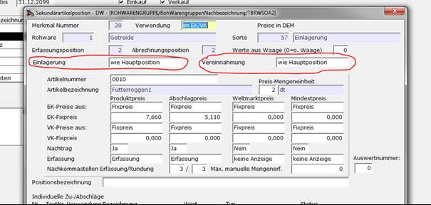

# Einrichtungen im Abrechnungsschema

<!-- source: https://amic.de/hilfe/einrichtungenimabrechnungssche.htm -->

Hauptmenü > Rohwarenabrechnung \> Rohwaren-Verwaltung > Bearbeiten > Abrechnungsschema

Direktsprung **[RWG]**

In einem Abrechnungsschema können zusätzlich zum Lieferartikel noch weitere mengenrelevante Warenpositionen vorhanden sein. Je nach Anwendung wird man sich entscheiden müssen, ob diese Menge auch wie Einlagerung / Vereinnahmung oder wie normal zu buchende Positionen behandelt werden sollen. Hierfür wurden für die Sekundärartikelpositionen Kennzeichen geschaffen. Man stellt hier ein ob deren Buchungsart wie die der Hauptposition zu behandeln ist.

In Qualitätsdefinitionen kann in den Feldern ‚Berechnung erfolgt‘ und ‚Ausdruck erfolgt‘ auch für Qualitäten, die sich nicht auf Einlagerungspositionen beziehen, einstellen, ob die Qualität in Abhängigkeit von Einlagerungs- und Vereinnahmungskennzeichen abzurechnen bzw. zu drucken ist oder nicht, getrennt nach linksseitiger (Analysewert kleiner Basiswert) und rechtsseitiger (Analysewert größer Basiswert) Abrechnungsdefinition. Die Einstellmöglichkeiten sind hier:

- Immer
- Nicht bei Einlagerung
- Nicht bei Vereinnahmung
- Nicht bei Einlagerung/Vereinnahmung
- Nur bei Einlagerung
- Nur bei Vereinnahmung
- Nur bei Einlagerung/Vereinnahmung

  In Kosten-/Vergütungs-Definitionen wird auf der Maske im Bereich ‚Berechnen ab:‘ zunächst die Belegstufe und danach der Berechnungsstatus in Abhängigkeit des Einlagerungs-/Vereinnahmungskennzeichens des Beleges mit entsprechenden Einstellmöglichkeiten festgelegt.
