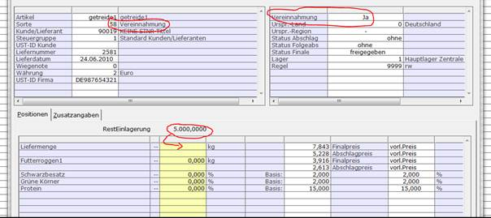

# Rohware-Erfassung

<!-- source: https://amic.de/hilfe/rohwareerfassung.htm -->

Hauptmenü > Rohwarenabrechnung > Rohwarenabrechnung > EK-Rohwarenbearbeitung

Direktsprung **[RWB]**

Hauptmenü > Rohwarenabrechnung > Rohwarenabrechnung > VK-Rohwarenbearbeitung

Direktsprung **[RWBV]**

Die Erfassung von Einlagerungsbelegen unterscheidet sich nicht von der normalen Rohwareerfassung.

Bei der Aufnahme von Vereinnahmungen gibt es jedoch kleine Unterschiede. Aeins führt über alle Einlagerungen pro Kunde und Artikel ein Bestandskonto.

Bei der Einlagerung wird dieses Konto erhöht, bei einer Vereinnahmung wird es wieder entlastet. Der aktuelle Stand dieses Kontos wird angezeigt, sofern man sich auf dem Mengenfeld einer für die Vereinnahmung relevanten Artikelposition befindet:

