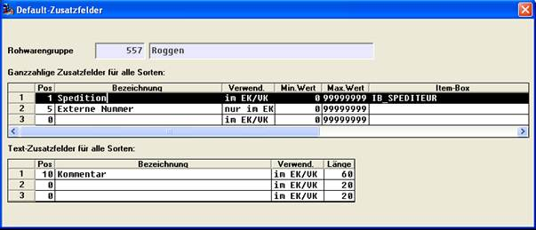
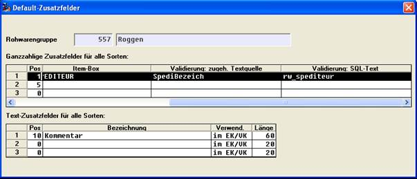

# Rohwarengruppen-Ergänzungsfelder

<!-- source: https://amic.de/hilfe/rohwarengruppenergnzungsfelder.htm -->

Hauptmenü > Rohwarenabrechnung \> Rohwaren-Verwaltung > Bearbeiten > Ergänzungsfelder

Direktsprung **[RWG]**

Die hier definierten Felder stehen ‚rohwarengruppenweit’, also für Belege aller Schemata der Rohwarengruppe zur Verfügung.

Siehe auch:

- [Ergänzungs-Werte](./ergaenzungs_werte.md)
- [Ergänzungs-Texte](./ergaenzungs_texte.md)
