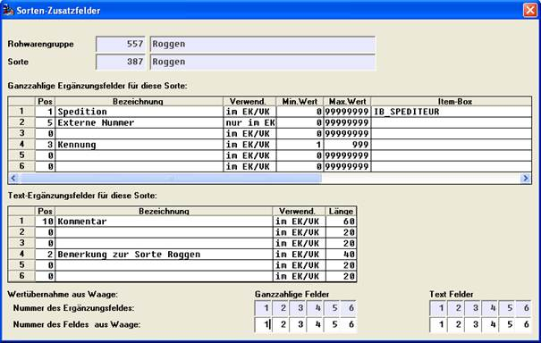

# Schemaspezifische-Ergänzungsfelder

<!-- source: https://amic.de/hilfe/_sortenspezifischeerg.htm -->

Hauptmenü > Rohwarenabrechnung \> Rohwaren-Verwaltung > Bearbeiten > Abrechnungsschema > Ergänzungsfelder

Direktsprung **[RWG]**

Die hier definierten Felder stehen zusätzlich zu den [‚rohwarengruppenweit’](./rohwarengruppen_ergaenzungsfelder/index.md) definierten Feldern für Belege des betreffenden Abrechnungsschemas zur Verfügung.

Der Aufbau der Blöcke zur Ergänzungs-Wert- und –Text-Definition entspricht dem der rohwarengruppen-spezifischen Angaben.

Pflegbar in den Blöcken sind auf dieser Maske jedoch lediglich die Zeilen 4, 5 und 6, deren Zeilennummern wiederum das korrespondierende Datenfeld der Relation V_Rohware (V_RohwareZFeldI4, V_RohwareZFeldI5 bzw. V_RohwareZFeldI6 bzw. V_RohwareZFeldC4, V_RohwareZFeldC5 bzw. V_RohwareZFeldC6) bestimmen.

Die Zeilen 1 bis 3 enthalten zur Orientierung die Angaben der zugrunde liegenden Rohwarengruppe.

Die Bedeutung der Angaben in den einzelnen Spalten entspricht der der rohwarengruppen-spezifischen Definitionen.

Im unteren Maskenbereich werden Ergänzungswert- (1.Block) und Ergänzungstextinhalte (2.Block) der Rohware-Waage-Schnittstelle den Felddefinitionen zugeordnet. Die jeweils obere blau unterlegte Zeile entspricht dabei der 1 Spalte des zugehörigen oberen Definitionsblocks. Darunter kann ein Ergänzungsfeld eines Waagedatensatzes einer Definitionszeile zugeordnet werden, indem unter der Definitionszeilennummer die Nummer des Wertes im Waage-Datensatz eingetragen wird.
