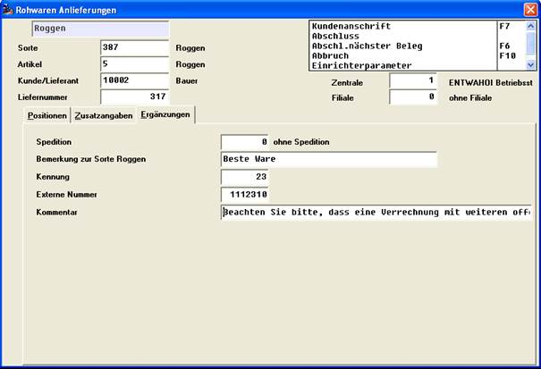

# Ergänzungs-Werte und –Texte in der Rohware-Bearbeitung

<!-- source: https://amic.de/hilfe/ergnzungswerteundtexteinderroh.htm -->

Hauptmenü > Rohwarenabrechnung > Rohwarenabrechnung > EK-Rohwarenbearbeitung

Direktsprung **[RWB]**

Hauptmenü > Rohwarenabrechnung > Rohwarenabrechnung > VK-Rohwarenbearbeitung

Direktsprung **[RWBV]**

Ist für das Abrechnungsschema des aktuell erfassten oder korrigierten Beleges mindestens ein rohwarengruppen- oder schemaspezifisches Ergänzungsfeld definiert (s.o.), so erhält die Bearbeitungsmaske eine weitere Tab-Card mit der Bezeichnung ‚Ergänzungen’, die die Bearbeitung der korrespondierenden Felder ermöglicht.

Beim Umwandeln von Rohware-Belegen ( Abschlag -, Folgeabschlag-, Finale vorbereiten, Lieferung-Stornobeleg, Abrechnungs-Stornobeleg ) werden Ergänzungsfelder automatisch übernommen.
