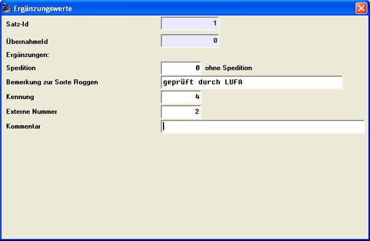
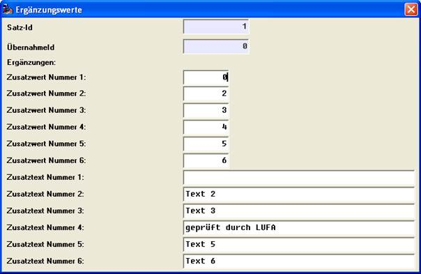

# Änderung-/Eintragen von Ergänzungsfelder in der Rohwaren-Waagen-Schnittstelle

<!-- source: https://amic.de/hilfe/nderungeintragenvonergnzungsfe.htm -->

Hauptmenü > Rohwarenabrechnung > Rohwarenabrechnung > EK-Waage-RWLieferungen > Ändern

Direktsprung **[RWWE]**

Hauptmenü > Rohwarenabrechnung > Rohwarenabrechnung > VK-Waage-RWLieferungen > Ändern

Direktsprung **[RWWV]**

Im Änderungsmodus der Waage-Datensätze können auch die Ergänzungsfelder bearbeitet werden (Funktion ‚Ergänzungswerte’ der Optionbox). Ist im Waage-Datensatz bereits eine Schemanummer vorhanden, so erfolgt die Bearbeitung der Felder entsprechen der Definitionen der zugehörigen rohwarengruppen- und schemaspezifischen Ergänzungsfelddefinitionen.

In diesem Fall stehen dann auch die dort angegeben Item-Boxen, Min-/Maximumtest und SQL-Text-Validierung für Integer-Werte sowie die Längenbegrenzung für Textfelder zur Verfügung.

Ist das Abrechnungsschema im Waagedatensatz hingegen nicht bekannt, so erfolgt die Bearbeitung in der Reihenfolge der Werte im Waagedatensatz (ErgaenzungsWert1 – 6, ErgaenzungsText1 – 6 ).

