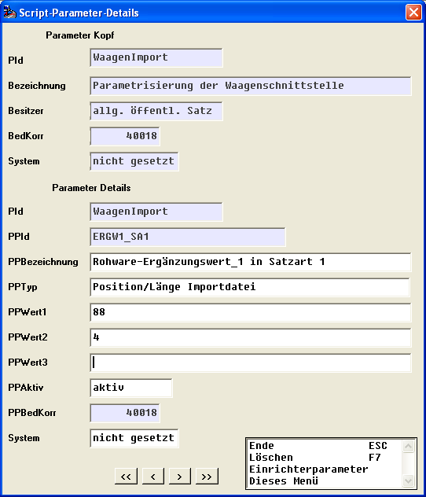

# Ergänzungs-Werte und –Texte in Rohware-Waage-Daten

<!-- source: https://amic.de/hilfe/ergnzungswerteundtexteinrohwar.htm -->

Direktsprung **[SCPA]**

Die Hauptrelation der Rohware-Waagen_Schnittstelle enthält je 6 Felder für Ergänzungs-Werte (Integer-Zahlen) und Egänzungstexte (ErgaenzungsWert1, ErgaenzungsWert2, ErgaenzungsWert3, ErgaenzungsWert4, ErgaenzungsWert5, ErgaenzungsWert6, ErgaenzungsText1, ErgaenzungsText1, ErgaenzungsText2, ErgaenzungsText3, ErgaenzungsText4, ErgaenzungsText5, ErgaenzungsText6), die bei der Erzeugung von Rohwarebelegen aus der Waagenschnittstelle den Angaben der Rohwarengruppen- und Abrechnungsschema-Definition entsprechend übernommen werden können.

Zur Versorgung der Schnittstellendatensätze aus einer Übernahmedatei mittels Daten-Import-Script gibt es dafür zusätzliche Script-Parameter:

Dabei bestimmt der Parameterwert1 jeweils die Position und der Parameterwert2 die Länge des jeweiligen Wertes im Übernahmesatz an.

Die folgende Tabelle enthält die für die Ergänzungsfelder zuständigen Script-Parameter :

| Script-Parameter | Bedeutung |
| --- | --- |
| ERGW1_SA1 | Rohware-Ergänzungs-Wert_1 in Satzart 1 |
| ERGW2_SA1 | Rohware-Ergänzungs-Wert_2 in Satzart 1 |
| ERGW3_SA1 | Rohware-Ergänzungs-Wert_3 in Satzart 1 |
| ERGW4_SA1 | Rohware-Ergänzungs-Wert_4 in Satzart 1 |
| ERGW5_SA1 | Rohware-Ergänzungs-Wert_5 in Satzart 1 |
| ERGW6_SA1 | Rohware-Ergänzungs-Wert_6 in Satzart 1 |
| ERGW1_SA2 | Rohware-Ergänzungs-Wert_1 in Satzart 2 |
| ERGW2_SA2 | Rohware-Ergänzungs-Wert_2 in Satzart 2 |
| ERGW3_SA2 | Rohware-Ergänzungs-Wert_3 in Satzart 2 |
| ERGW4_SA2 | Rohware-Ergänzungs-Wert_4 in Satzart 2 |
| ERGW5_SA2 | Rohware-Ergänzungs-Wert_5 in Satzart 2 |
| ERGW6_SA2 | Rohware-Ergänzungs-Wert_6 in Satzart 2 |
| ERGW1_SA3 | Rohware-Ergänzungs-Wert_1 in Satzart 3 |
| ERGW2_SA3 | Rohware-Ergänzungs-Wert_2 in Satzart 3 |
| ERGW3_SA3 | Rohware-Ergänzungs-Wert_3 in Satzart 3 |
| ERGW4_SA3 | Rohware-Ergänzungs-Wert_4 in Satzart 3 |
| ERGW5_SA3 | Rohware-Ergänzungs-Wert_5 in Satzart 3 |
| ERGW6_SA3 | Rohware-Ergänzungs-Wert_6 in Satzart 3 |
| ERGW1_SA4 | Rohware-Ergänzungs-Wert_1 in Satzart 4 |
| ERGW2_SA4 | Rohware-Ergänzungs-Wert_2 in Satzart 4 |
| ERGW3_SA4 | Rohware-Ergänzungs-Wert_3 in Satzart 4 |
| ERGW4_SA4 | Rohware-Ergänzungs-Wert_4 in Satzart 4 |
| ERGW5_SA4 | Rohware-Ergänzungs-Wert_5 in Satzart 4 |
| ERGW6_SA4 | Rohware-Ergänzungs-Wert_6 in Satzart 4 |
| ERGT1_SA1 | Rohware-Ergänzungs-Text_1 in Satzart 1 |
| ERGT2_SA1 | Rohware-Ergänzungs-Text_2 in Satzart 1 |
| ERGT3_SA1 | Rohware-Ergänzungs-Text_3 in Satzart 1 |
| ERGT4_SA1 | Rohware-Ergänzungs-Text_4 in Satzart 1 |
| ERGT5_SA1 | Rohware-Ergänzungs-Text_5 in Satzart 1 |
| ERGT6_SA1 | Rohware-Ergänzungs-Text_6 in Satzart 1 |
| ERGT1_SA2 | Rohware-Ergänzungs-Text_1 in Satzart 2 |
| ERGT2_SA2 | Rohware-Ergänzungs-Text_2 in Satzart 2 |
| ERGT3_SA2 | Rohware-Ergänzungs-Text_3 in Satzart 2 |
| ERGT4_SA2 | Rohware-Ergänzungs-Text_4 in Satzart 2 |
| ERGT5_SA2 | Rohware-Ergänzungs-Text_5 in Satzart 2 |
| ERGT6_SA2 | Rohware-Ergänzungs-Text_6 in Satzart 2 |
| ERGT1_SA3 | Rohware-Ergänzungs-Text_1 in Satzart 3 |
| ERGT2_SA3 | Rohware-Ergänzungs-Text_2 in Satzart 3 |
| ERGT3_SA3 | Rohware-Ergänzungs-Text_3 in Satzart 3 |
| ERGT4_SA3 | Rohware-Ergänzungs-Text_4 in Satzart 3 |
| ERGT5_SA3 | Rohware-Ergänzungs-Text_5 in Satzart 3 |
| ERGT6_SA3 | Rohware-Ergänzungs-Text_6 in Satzart 3 |
| ERGT1_SA4 | Rohware-Ergänzungs-Text_1 in Satzart 4 |
| ERGT2_SA4 | Rohware-Ergänzungs-Text_2 in Satzart 4 |
| ERGT3_SA4 | Rohware-Ergänzungs-Text_3 in Satzart 4 |
| ERGT4_SA4 | Rohware-Ergänzungs-Text_4 in Satzart 4 |
| ERGT5_SA4 | Rohware-Ergänzungs-Text_5 in Satzart 4 |
| ERGT6_SA4 | Rohware-Ergänzungs-Text_6 in Satzart 4 |

Siehe auch:

- [Änderung-/Eintragen von Ergänzungsfelder in der Rohwaren-Waagen-Schnittstelle](./aenderung_eintragen_von_ergaenzungsfelder_in_der_rohwaren_wa.md)
