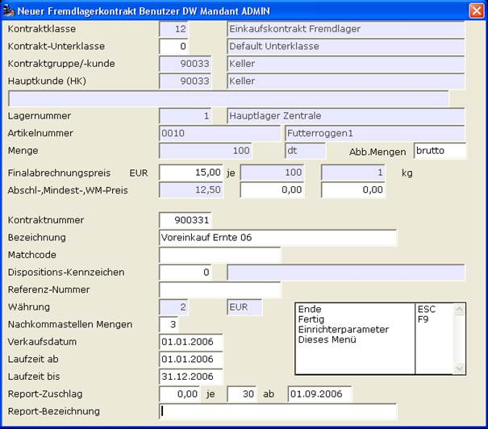

# Zusatzinfo in Fremdkontrakt

<!-- source: https://amic.de/hilfe/zusatzinfoinfremdkontrakt.htm -->

Fremdkontrakte für Artikel mit Rohwarengruppe enthalten zusätzliche Felder für die Rohware-Bearbeitung:

[Abbuchungsmenge](./abbuchungsmenge_brutto_netto.md) (brutto/netto)

[Finalabrechnungspreis](./finalabrechnungspreis.md)

[Abschlagpreis](./abschlagpreis.md)

[Mindestpreis](./mindestpreis.md)

[Weltmarktpreis](./weltmarktpreis.md)
