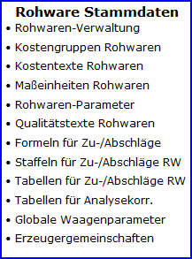

# Konstanten und Tabellen für die Einrichtung von Abrechnungsschemata (Sorten)

<!-- source: https://amic.de/hilfe/konstantenundtabellenfrdieeinr.htm -->

Hauptmenü > Rohwarenabrechnung

Siehe auch:

- [Rohware-Maßeinheiten](./rohware_masseinheiten.md)
- [Rohware-Qualitätstexte](./rohware_qualitaetstexte.md)
- [Rohware-Kostentexte](./rohware_kostentexte.md)
- [Rohware-Tabellen für Zu- und Abschläge](./rohware_tabellen_fuer_zu_und_abschlaege.md)
- [Rohware-Tabellen für Zu- und Abschlag-Staffeln](./rohware_tabellen_fuer_zu_und_abschlag_staffeln.md)
- [Rohware-Formeln für Zu- und Abschläge](./rohware_formeln_fuer_zu_und_abschlaege.md)
- [Rohware-Tabellen zur Analysewertkorrektur](./rohware_tabellen_zur_analysewertkorrektur.md)
- [Rohware-Kostengruppen für Kosten-/Vergütungssätze und -pauschalen](./rohware_kostengruppen_fuer_kosten_verguetungssaetze_und_paus.md)
- [Globale Waagenparameter](./globale_waagenparameter.md)
