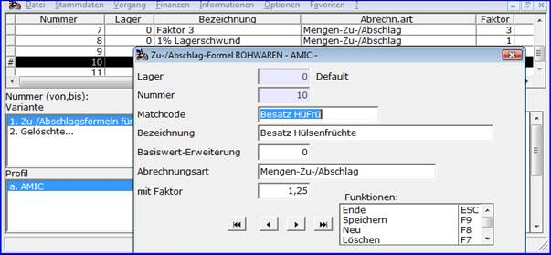

# Rohware-Formeln für Zu- und Abschläge

<!-- source: https://amic.de/hilfe/rohwareformelnfrzuundabschlge.htm -->

Hauptmenü > Rohwarenabrechnung \> Formeln für Zu-/Abschläge

In [Rohwarengruppen](../vorgehensweise_bei_der_einrichtung_von_abrechnungsschemata_s.md#Rohwarengruppendef) deklarierte und in [Abrechnungsschemata](../vorgehensweise_bei_der_einrichtung_von_abrechnungsschemata_s.md#Schemadef) näher definierte [Qualitäten](../vorgehensweise_bei_der_einrichtung_von_abrechnungsschemata_s.md#QPosDef) können unter anderem mittels Formeln bei der Abrechnung eines Rohwarebeleges einen Zuschlag oder Abschlag auf die Menge (**Abrechnungsart ‚Mengen-Zu-/Abschlag‘, ‚** **Mengen-Zu-/Abschl. mit Preisgew.‘, ‚Mengen-Zu-/Abschl. mit WmPr.gew.‘**) oder Preis (**Abrechnungsart ‚Preiszu-/abschlag‘**) einer bestimmten Warenposition bewirken. Ein Zuschlag beziehungsweise Abschlag wird hier dadurch ermittelt, dass zunächst ein %-Wert aus Umrechnungsfaktor multipliziert mit der Analysewert/Basiswert-Differenz (ergänzt um die Basiserweiterung) ermittelt wird, in den Abrechnungsarten mit Preis- bzw. Weltmarktpreisgewichtung multipliziert mit dem entsprechenden Preis (umgerechnet auf eine Mengeneinheit), und dieser dann auf die in der Qualitätsdefinition angegebene Bezugsmenge bzw. den Bezugspreis angewendet wird. 

**Besonderheiten der Lagernummer**: Das Abrechnungssystem sucht eine Zu-/Abschlag-Formel-Einrichtung zunächst mit der Lagernummer des Rohwarebeleges. Ist diese nicht eingerichtet, so wird auf die Einrichtung zur Lagernummer ‚0‘ zurückgegriffen.
