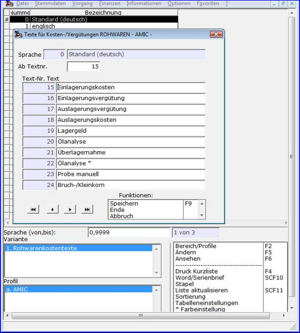

# Rohware-Kostentexte

<!-- source: https://amic.de/hilfe/rohwarekostentexte.htm -->

Hauptmenü > Rohwarenabrechnung \> Kostentexte Rohwaren

Kostentexte werden den Kosten- und Vergütungspositionen in [Rohwarengruppendefinitionen](../vorgehensweise_bei_der_einrichtung_von_abrechnungsschemata_s.md#Rohwarengruppendef) mittels der Kostentextnummer zugeordnet. Bei der Erfassung, Ansicht oder Korrektur von Rohwarebelegen bzw. in Auswertungen ist die jeweilige Position durch die hier angegebene Bezeichnung identifizierbar. Die per Formulareinrichtung festgelegte Druckposition eines Kosten- oder Vergütungstextes wird, abweichend zum Artikeltext des durch die Position gebuchten Artikels, ebenfalls mit dem hier festgelegten Text in der jeweiligen Belegsprache versorgt.
