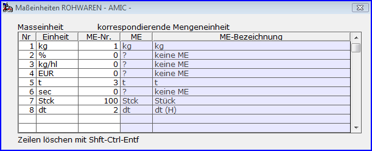

# Rohware-Maßeinheiten

<!-- source: https://amic.de/hilfe/rohwaremaeinheiten.htm -->

Hauptmenü > Rohwarenabrechnung \> Maßeinheiten Rohwaren

Mengen von Warenpositionen und Kosten-/Vergütungspositionen sowie Analysewerte von Qualitätspositionen werden in den [Rohwarengruppendefinitionen](../vorgehensweise_bei_der_einrichtung_von_abrechnungsschemata_s.md#Rohwarengruppendef) Maßeinheiten zugeordnet, die in diesem Programm-Modul zu hinterlegen sind. Dabei müssen Maßeinheiten, die für Mengen der Waren-/Kosten-/Vergütungspositionen vorgesehen sind, die jeweils korrespondierende Mengeneinheit zuzuordnen. Maßeinheiten ohne Mengeneinheitszuordnung sind als Einheiten für Analysewerte und gegebenenfalls für Waren-/Kosten-/Vergütungspositionen vorgesehen, die lediglich als Wertartikel (ohne Menge) oder Pauschalkosten/-vergütungen gebucht werden.
