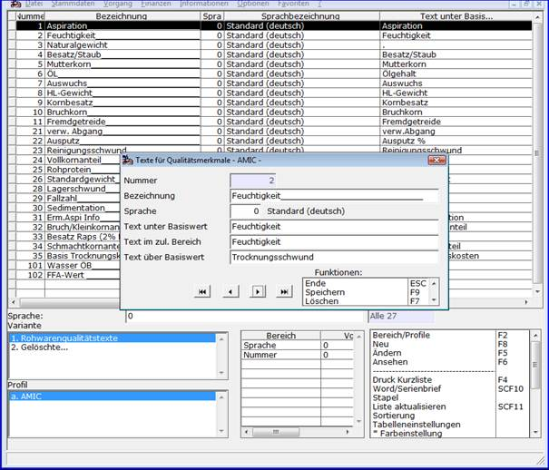

# Rohware-Qualitätstexte

<!-- source: https://amic.de/hilfe/rohwarequalittstexte.htm -->

Hauptmenü > Rohwarenabrechnung \> Qualitätstexte Rohwaren

Qualitätstexte werden den Qualitäten in [Rohwarengruppendefinitionen](../vorgehensweise_bei_der_einrichtung_von_abrechnungsschemata_s.md#Rohwarengruppendef) mittels der Qualitätstextnummer zugeordnet. Bei der Erfassung, Ansicht oder Korrektur von Rohwarebelegen bzw. in Auswertungen ist die jeweilige Qualität durch die hier angegebene Bezeichnung identifizierbar. Die per Formulareinrichtung festgelegte Druckposition eines Qualitätstextes wird je nach Analysewert/Basiswert-Beziehung mit dem jeweils hier festgelegten Text in der jeweiligen Belegsprache versorgt.
