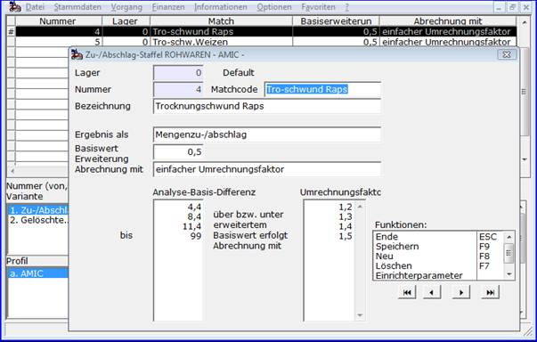

# Rohware-Tabellen für Zu- und Abschlag-Staffeln

<!-- source: https://amic.de/hilfe/rohwaretabellenfrzuundabschlag.htm -->

Hauptmenü > Rohwarenabrechnung \> Staffeln für Zu-/Abschläge RW

In [Rohwarengruppen](../vorgehensweise_bei_der_einrichtung_von_abrechnungsschemata_s.md#Rohwarengruppendef) deklarierte und in [Abrechnungsschemata](../vorgehensweise_bei_der_einrichtung_von_abrechnungsschemata_s.md#Schemadef) näher definierte [Qualitäten](../vorgehensweise_bei_der_einrichtung_von_abrechnungsschemata_s.md#QPosDef) können unter anderem mittels Zu- und Abschlag-Staffeln bei der Abrechnung eines Rohwarebeleges einen Zuschlag oder Abschlag auf die Menge (**Ergebnis als ‚Mengenzu-/abschlag‘**) oder Preis (**Ergebnis als ‚Preiszu-/abschlag‘**) einer bestimmten Warenposition bewirken. In der Variante **Abrechnung mit ‚einfacher Umrechnungsfaktor‘** wird ausgehend von der **Analysewert/Basiswertdifferenz** ergänzt um die **Basiserweiterung** zunächst der zugehörige **Umrechnungsfaktor** ermittelt. Dieses ergibt multipliziert mit der (erweiterten) Analysewert/Basiswertdifferenz die Preis- oder Mengen-Änderung pro 100 Mengen- bzw. Preiseinheiten ( in der Regel also kg/dt oder ct/Euro ), also in Prozent. Die Basiserweiterung trägt der Tatsache Rechnung, dass beispielsweise erst ab einem Analysewert über 15,0 % Feuchtigkeit getrocknet werden soll, dann aber bis auf 14,5 % (Basiserweiterung = 0,5).  
Bei einem Analysewert von 18,3% und einem Basiswert von 9,0% würde sich mit angegebener Beispiel-Staffel folgende Rechnung ergeben:  
(Analysewert 18,3 – Basiswert 9,0) + Basiserweiterung 0,5 = 9,8  
Umrechnungsfaktor 1,4 \* 9,8 = 13,72% 

In der Variante <strong>Abrechnung mit ‚gestaffelte Abrechnung‘</strong> erfolgt die Ermittlung des Ergebnis-Prozentwerts als Summe der ermittelten Ergebnis-Prozentwerte der einzelnen Intervalle. Bei einem Analysewert von 18,3% und einem Basiswert von 9,0% würde sich mit angegebener Beispiel-Staffel folgende Rechnung ergeben:  
(Analysewert 18,3 – Basiswert 9,0) + Basiserweiterung 0,5 = 9,8  
1\. Intervall: bis 4,4 mit Umrechnungsfaktor 1,2 ergibt 4,4\*1,2 = 5,28%  
2\. Intervall: bis 8,4 mit Umrechnungsfaktor 1,3 ergibt 4,0\*1,3 = 5,20%  
3\. Intervall: bis 9,8 mit Umrechnungsfaktor 1,4 ergibt 1,4\*1,4 = 1,96%  
ergibt als Ergebnis 5,28+5,20+1,96 = 12,44%

**Besonderheiten der Lagernummer**: Das Abrechnungssystem sucht eine Zu-/Abschlag-Staffel zunächst mit der Lagernummer des Rohwarebeleges. Ist diese nicht eingerichtet, so wird auf die Staffel zur Lagernummer ‚0‘ zurückgegriffen.
