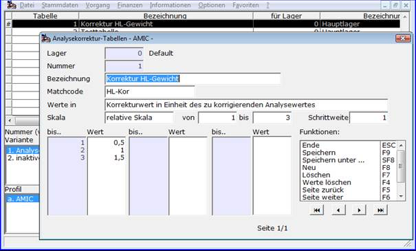

# Rohware-Tabellen zur Analysewertkorrektur

<!-- source: https://amic.de/hilfe/rohwaretabellenzuranalysewertk.htm -->

Hauptmenü > Rohwarenabrechnung \> Tabellen für Analysekorrektur

In [Rohwarengruppen](../vorgehensweise_bei_der_einrichtung_von_abrechnungsschemata_s.md#Rohwarengruppendef) deklarierte und in [Abrechnungsschemata](../vorgehensweise_bei_der_einrichtung_von_abrechnungsschemata_s.md#Schemadef) näher definierte [Qualitäten](../vorgehensweise_bei_der_einrichtung_von_abrechnungsschemata_s.md#QPosDef) können unter anderem mittels Analysewert-Korrektur-Tabellen einen erfassten Analysewert bzgl. der Analysewerte anderer Qualitäten in einen korrigierten Analysewert umrechnen, der dann anstelle des Originalwertes die Abrechnungsgrundlage bildet. Die Angabe **‚Werte in‘** legt die Interpretation der Tabellenwerte als **‚Prozentsatz‘** oder **‚Korrekturwert in Einheit des zu korrigierenden Analysewertes‘** fest. Die Indexwerte der Skala beziehen sich auf den Analysewert (**‚Fixskala‘**) bzw. die Analysewert/Basiswertdifferenz (**‚relative Skala‘**) einer in der Qualitätsdefinition angegebenen Referenzqualität. Der Wert, um den der Analysewert der aktuellen Qualität zu korrigieren ist, wird dann der Spalte <strong>‚Wert‘</strong> zum Skalenwert entnommen.

Die Angaben in den Feldern ‚**von**‘, ‚**bis**‘ und ‚**Schrittweite**‘ legen die **Indexwerte** der Tabelle für die Pflege fest, zu denen dann die Ergebniswerte eingetragen werden. **Zu beachten** ist jedoch, dass das Abrechnungsmodul bei über den hier festgelegten letzten Indexwert auftretendem Indexwert einen Ergebniswert aus den für die letzten beiden Indexwerte eingetragenen (zugeordneten) Ergebniswerten zu ermitteln. Dieses geschieht durch dynamisches fortschreiben der Tabelle mit der angegebenen Schrittweite und der Differenz der letzten beiden Ergebniswerte. So wäre der Ergebniswert für obiges Beispiel bei einer Analysewert/Basiswertdifferenz von 6,0 = 3,0  
(Indexwert 6,0 – letzter Indexwert 3 = 3 Indexdifferenz  
 = 3 \* Schrittweite 1   
 also 3 \* (letzter Ergebniswert 1,5 – vorletzter Ergebniswert 1) = 1,5  
 und daher 1,5 + 1,5 = 3,0 Ergebniswert zu Indexwert 6)

Der Ergebniswert von 6 wird in dem Beispiel für alle Analysewert/Basiswertdifferenzen der Referenzqualität, die größer als 5 und kleiner oder gleich 6 sind.

**Besonderheiten der Lagernummer**: Das Abrechnungssystem sucht eine Analysewertkorrekturtabelle zunächst mit der Lagernummer des Rohwarebeleges. Ist diese nicht eingerichtet, so wird auf die Tabelle zur Lagernummer ‚0‘ zurückgegriffen.
