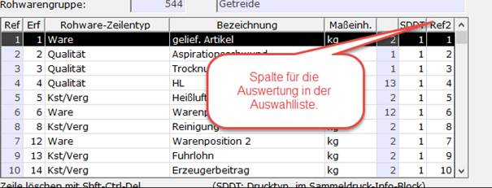
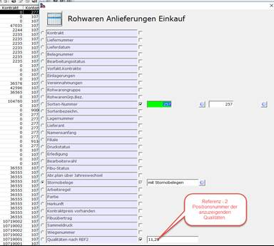

# Nachhaltigkeit in der Rohware

<!-- source: https://amic.de/hilfe/_nachhaltig_rw.htm -->

Nachhaltigkeitswerte werden aus den eingetragenen Angaben für die [Artikel](../artikelstamm_und_artikel/parameter_des_artikelstamms/registerkarte_zertifiakte.md#ars_nachhaltigkeit), [Kunden/Lieferanten](../kunden_und_lieferanten/kunden_und_lieferantenstamm/zertifikate.md), [Kontrakte](../kontrakt/kontraktstammdaten/kontraktartikel/index.md) etc. auch bei der Rohwarenerfassung ermittelt (siehe [Nachhaltigkeit](../vorgangsabwicklung/nachhaltigkeit/index.md)) und in den Beleg übernommen.

Sofern das Kennzeichen **Nachhaltigkeitsartikel** im Artikelstamm zur Lieferposition eines Rohware-Belegs mit dem Wert **Ja** belegt ist, werden die Nachhaltigkeitsdaten und deren Herkunft (Artikel, Kunde, Kontrakt, Anbaugebiet oder manuell) zum Hauptartikel des Rohware-Belegs im oberen rechten Bearbeitungs-Grid dargestellt.  
In der Regel sollten die so ermittelten Nachhaltigkeitsdaten bereits die zum aktuellen Beleg passenden sein. Dennoch sind diese Daten grundsätzlich manuell bis einschließlich der ersten Abrechnungsstufe (Abschlag oder, bei direkter Endabrechnung, Finale) änderbar. Es ist jedoch zu beachten, dass bei Änderung von Artikel, Kunde/Lieferant oder Kontrakt eine erneute Initialisierung stattfindet und manuelle Werte eventuell wieder überschrieben werden. Eine Ausnahme hiervon ist in der Funktion [***Schema-/Kundenänderung***](./rohwarenbearbeitung/schema_kundenaenderung/allgemeine_erlaeuterung.md) zur nachträglichen Änderung von Abrechnungsschema, Artikel und/oder Kunde/Lieferant implementiert. Auch dort werden die Nachhaltigkeitswerte zunächst neu ermittelt aber durch im Ursprungsbeleg manuell geänderte Werte überschrieben!

Sollen THG-/TSW-Werte als Abrechnungspositionen in Rohwarebelegen berücksichtigt werden, so können entsprechende Definitionen als [Qualitätsposition mit Analysewertkopplung](./vorgehensweise_bei_der_einrichtung_von_abrechnungsschemata_s.md#QPosDef) eingerichtet werden. Dabei wird der Analysewert an den gewünschten THG-/TSW-Wert der bezogenen Warenposition ‚gekoppelt‘.

Soll der THG Wert als Qualitätsparameter mit erfasst werden, so muss in der Einrichtung UNBEDINGT die Nummer der Bezeichnung 1501 sein, denn nur in diesem Falle werden die in der Qualität eingetragenen Wert auch korrekt in die Massebilanz übernommen.

In der zugrundeliegende Auswahlliste der Rohwarenanlieferungen wird der Anbau THG Wert mit angezeigt. Weiterhin lassen sich bis zu 9 weitere Qualitätswerte mit in der Auswahlliste anzeigen, hierzu ist die Ref Position 2 in der Rohwarengruppeneinrichtung mit zu pflegen.

Die Zahl entspricht dem Wert der Artikelbestanmdteilnummer, hieraus wird auch die Überschrift der Auswahlliste versorgt. Die Eingabe der anzuzeigenden Qualitätswerte wird durch Angabe der „ref2“ Nummer oder auch dann der Nummer aus der Artikelbestandteilliste mit Komma getrennt erwartet.

Am rechten Ende der Auswahlliste werden die Qualitäten mit angezeigt.
