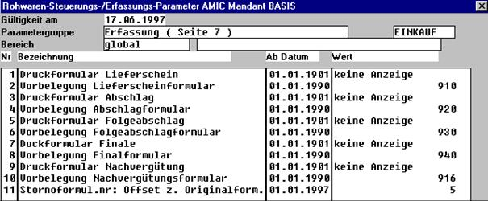
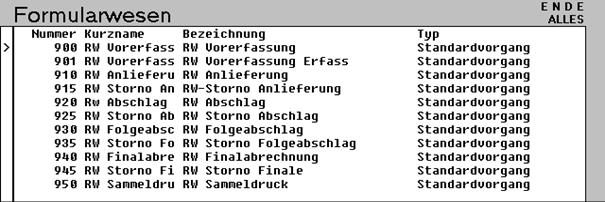

# Formularzuordnung

<!-- source: https://amic.de/hilfe/formularzuordnung1.htm -->

Hauptmenü > Administration \> Steuerung > Steuerparameter zeigen

Direktsprung **[RWPA]**

In den Rohwarenparametern sollten die entsprechenden Formulare den Abrechnungsschritten zugeordnet werden.

In der Basis-DB sind folgende Rohwarenformulare (RW) bereits eingerichtet

Siehe Muster - Gutschriften im Anhang!
