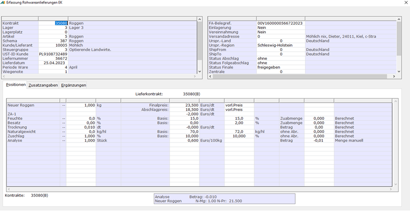
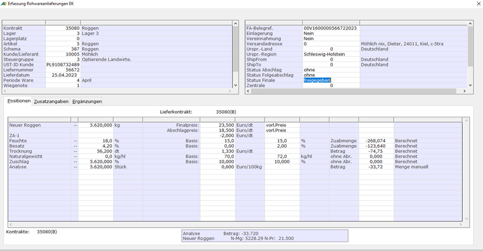

# Rohwarebelege erfassen

<!-- source: https://amic.de/hilfe/rohwarebelegeerfassen.htm -->

Hauptmenü > Rohwarenabrechnung > Rohwarenabrechnung > EK-Rohwarenbearbeitung > Lieferung erfassen

Direktsprung **[RWB]**

Hauptmenü > Rohwarenabrechnung > Rohwarenabrechnung > VK-Rohwarenbearbeitung > Lieferung erfassen

Direktsprung **[RWBV]**

Die Abfragefelder der Erfassungsmaske für Rohware-Lieferscheine wie auch die Reihenfolge der Abfrage werden durch die generellen Rohwarenparameter [RWPA] sowie durch das Abrechnungsschema bestimmt.

So ist zum Beispiel dort festgelegt, ob zunächst der Artikel ausgewählt und damit das zugehörige Default-Abrechnungsschema der zugeordneten Rohwarengruppe wird, oder anderenfalls zunächst ein Abrechnungsschema angegeben und ein entsprechend der zugehörigen Rohwarengruppe passender Artikel zum Lager vorgeschlagen wird.

Aus dieser Kombination füllt sich der Warenerfassungsteil der Abrechnung entsprechend der Angaben des gewählten Abrechnungsschemas.

Die ersten beiden möglichen Erfassungsfelder dienen jedoch der Auswahl von Kontrakt und Lagernummer. Dabei ist zu beachten, dass die Lagernummer zunächst aus den Vorgangskonstanten vorbelegt wird. Sie kann jedoch bei Einstellung des Rohwareparameters [*Lager*](../rohwareparameter_einrichten/rohwareparameter_uebersicht.md#RWPA_2) mit dem Wert ‚*Erfassung*‘ geändert werden.

Ist der Erfassungsbeginn per Kontraktauswahl durch den Rohwareparameter [Erfassungsstart mit Kontraktnummer](../rohwareparameter_einrichten/rohwareparameter_uebersicht.md#RWPA_177) aktiviert, so kann als erste Aktion der Erfassung ein Rohwarekontrakt oder ein Voreinkaufs- bzw. Vorverkaufskontrakt angegeben werden. Hieraus werden dann Artikel- und Kundendaten in den Beleg übernommen und der Kontrakt bereits der Lieferwarenposition zugeordnet. Dabei wird bei lagerspezifischen Kontrakten die Lagernummer entsprechend der Kontraktposition übernommen. Andernfalls wird die vorgegebene Lagernummer beibehalten, sofern der angesprochene Artikel auf dem Lager existiert.

Während des Erfassungsvorgangs können auch die Kopfdaten wie Artikelnummer, Lagernummer, Kundennummer und Kontrakt geändert werden. Dabei werden eventuell bereits gemachte Angaben im Positionsteil (Mengen, Preise, Analysewerte etc.) auf ein sich dadurch gegebenenfalls wechselndes Abrechnungsschema übertragen, sofern die Identifizierung der einzelnen Positionen per übereinstimmender Referenznummer laut Abrechnungsschemadefinition gegeben ist.

Bei der Positionierung des Cursors im Positionsteil auf ein Feld zu einer Warenposition (Lieferposition oder Sekundärartikelposition), ist bei Existenz von Rohware-Kontrakten zum Artikel und Lieferanten/Kunden in der Optionbox die Funktion **Kontrakt** der Position ein Kontrakt zugeordnet werden. Ist der Position bereits ein Kontrakt zugeordnet, so kann diese auch mittels der Funktion **Kontrakt abwählen** zurückgenommen werden.

In der Erfassungsmaske wird in diesem Beispiel der Artikel 5 mit dem Abrechnungsschema 387 erfasst. Nach der Mengeneingabe wurde eine Partie angelegt und zugeordnet, bei dem Kontrakt handelt es sich im einen Bruttomengenkontrakt (B).

 Bruttomenge 5620 kg

 Feuchtigkeit 18,0 %

 Besatz t 4,2 %

 Hektolitergewicht noch unbekannt kg/hl

Die Trocknungskosten rechnen sich hier auf der Basis Bruttomenge mit der Qualitätsangabe aus Feuchtigkeit.

Diese Anlieferung ist für Abschlagsabrechnungen freigegeben, es erfolgen keine Folgeabschläge, die Finalabrechnung ist noch gesperrt.

In den hinteren drei Spalten werden Angaben bezüglich des jeweiligen Qualitäts-Zu-/-Abschlag bzw. des Kosten-/Vergütungsbetrages. Bei entsprechender Einstellung der Rohwareparameter [Qualitätsergebnis änderbar](../rohwareparameter_einrichten/rohwareparameter_uebersicht.md#RWPA_192) und [Kostenergebnis änderbar](../rohwareparameter_einrichten/rohwareparameter_uebersicht.md#RWPA_193) können diese Werte manuell überschrieben werden. Dargestellt wird hier auch die Art des Qualitäts-Zu-/-Abschlags(„Zuabmenge“ bzw. “ Zuabpreis“ oder „ohne Abr.“), bei Kosten-/Vergütungen immer nur „Betrag“. Des Weiteren wird hinter dem jeweiligen Wert ausgewiesen, ob es sich um einen berechneten oder manuellen Wert handelt.

Bei manueller Änderung eines Kostenbetrages wird, sofern es sich nicht um eine Kostenpauschale handelt, der Preis neu berechnet, auch wenn dieser manuell gesetzt wurde. Gegebenenfalls wird das manuelle Preiskennzeichen zurückgesetzt.  
Entsprechend wird bei manueller Preiseingabe das manuelle Kennzeichen des Betrages zurückgesetzt und dieser neu berechnet.

Wenn bei manueller Menge der Preis oder der Betrag geändert wird, führt dies zur Anzeige von „Menge und Preis manuell“ bzw. „Menge und Betrag manuell“.

Zum Löschen eines manuellen Qualitäts-Zu-/-Abschlag-Ergebnisses oder Kosten-/Vergütungsbetrages, wird der manuelle Wert durch Leeren des Feldes gelöscht und bei Verlassen des Feldes neuberechnet.
