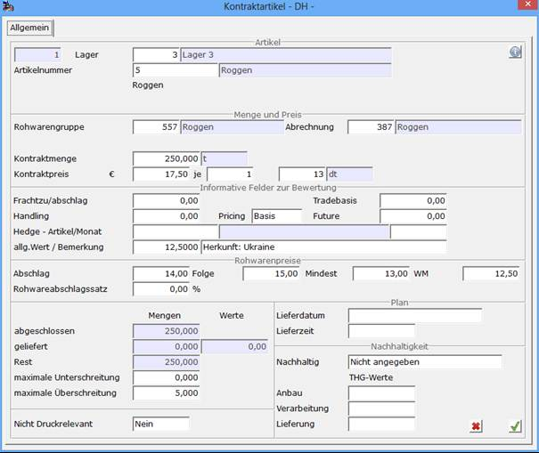

# Rohwarenkontrakte

<!-- source: https://amic.de/hilfe/rohwarenkontrakte.htm -->

Hauptmenü > Kontraktverwaltung > Kontraktbearbeitung > Kontrakt Stammdaten

Direktsprung **[KTR]**

Eine Sonderform der Kontrakte stellen die Rohwarenkontrakte dar.

Wird bei der Kontraktanlage [KTR] die Klasse Einkauf Rohware (13) oder Verkauf Rohware (3) gewählt, verändert sich die Maske bei der Artikeleingabe wie folgt:

Zusätzlich zu Menge und Ausgangspreis für die finale Rohwarenabrechnung können hier jetzt eine Rohwarengruppe und ein zugehöriges Abrechnungsschema angegeben werden, die bei der Kontraktauswahl als Selektionsfilter wirken.

Ebenfalls können evtl. abzurechnende Nebenpreise

- Ausgangspreis für Abschlagabrechnung
- Ausgangspreis für Folgeabschlagabrechnung
- Mindestpreis-Vereinbarung
- Weltmarktpreisfestsetzung
- %-Satz zur Abschlag-/Folgeabschlagermittlung

  festgelegt werden, sofern diese für Rohwareabrechnungen abweichend von im Abrechnungsschema festgelegten Konditionen vereinbart sind.
