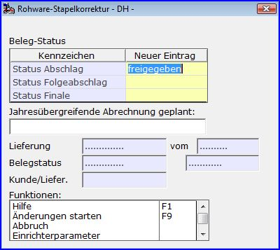

# Statusstapelkorrektur

<!-- source: https://amic.de/hilfe/statusstapelkorrektur.htm -->

Hauptmenü > Rohwarenabrechnung > Rohwarenabrechnung > EK-Rohwarenbearbeitung

Direktsprung **[RWB]**

Hauptmenü > Rohwarenabrechnung > Rohwarenabrechnung > VK-Rohwarenbearbeitung

Direktsprung **[RWBV]**

Im Modul Rohwarenbearbeitung können in der Auswahlvariante <em>‘Rohwarestatusstapelkorrektur’</em> Belegstatus-Änderungen für mehrere Belege gleicher Stufe in einem Arbeitsschritt durchgeführt werden, die noch nicht weiterverarbeitet sind. Final-Belege können nur bverücksichtigt werden, wenn sie weder gedruckt noch gebucht sind.  
Hier wird mit der Funktion ‚*Status-Stapelkorrektur*’ eine Maske zur Eingabe der zu ändernden Beleg-Status-Kennzeichen aufgerufen.

Grundsätzlich können Lieferungen und Abrechnungsbelege der Stufen Abschlag, Folgeabschlag und Finale korrigiert werden. So können zum Beispiel auch in bereits gebuchten Abschlagbelegen die Statusinformation der Stufen Folgeabschlag und Finale auf den Wert ‚*Freigegeben*‘ gesetzt werden. Der eigene Status zur Belegstufe selbst kann nur von ‚*Abgerechnet*‘ zurückgesetzt werden, wenn der Beleg noch nicht gebucht wurde. Zu beachten ist, dass Rohwarelieferungen zu Voreinkäufen oder Vorverkäufen nur per Finalabrechnung weiterbearbeitbar sind. Daher sind für derartige Belege die Statuskennzeichen für die Stufen Abschlag und Folgeabschlag nicht änderbar. Diese haben immer den Wert ‚*ohne*‘, da der jeweils zugrundeliegende Voreinkauf beziehungsweise Vorverkauf anteilig als Abschlagzahlung in der Finalabrechnung berücksichtigt wird.  
Neben den Belegstatus-Werten kann an dieser Stelle auch das Kennzeichen zur Steuerung der jahresübergreifenden Abrechnung mittels Pro-Forma-Abrechnung angegeben werden.  
Die gewünschten Änderungen werden mittels der Funktion ‚*Änderungen starten*‘ in allen ausgewählten Belegen durchgeführt.
