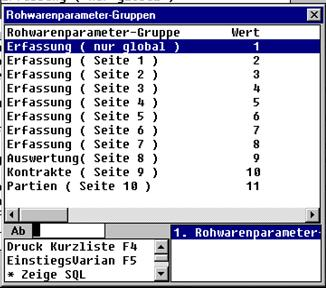

# Steuerparameter der Rohwarenabrechnung

<!-- source: https://amic.de/hilfe/steuerparameterderrohwarenabre.htm -->

Hauptmenü > Administration \> Steuerung > Steuerparameter zeigen

Direktsprung **[RWPA]**

**Wert Sort. Bezeichnung Gruppe** 

1 1 "Artikel/Schema-Auswahl" nur global

1 2 "Erfassungsstapel mit Liefermengensummen"

1 3 "Ab Kundennummer bei Folgebeleg"

1 4 "Filiale"

1 5 "Filiale aus Kundenstamm"

1 6 "Erfassung der Zentrale"

1 7 "Zentrale aus Filialstamm"

1 8 "Abteilung"

1 9 "Unterabteilung"

1 10 "Lieferdatum > Erfassungsdatum erlaubt"

1 11 "Liefermengensperre bei Korrektur"

1 12 "Kippwaagen-Kontrollrechnung"

1 13 "Kundenanschrift Autoanzeige"

1 14 "Artikelauswahl-Randbedingung"

2 1 "Lager" Erfassung (Seite 1)

2 2 "Lagerplatz"

2 3 "Liefer-Datum"

2 4 "Lieferscheinnummer"

2 5 "Vorbelegung Lieferscheinnummer"

2 6 "Wiegenoten-Nummer"

2 7 "Vorbelegung Wiegenoten-Nummer"

2 8 "Versandart"

2 9 "Vorbelegung Versandart"

2 10 "abweichende Versandadresse erlaubt"

2 11 "Kippwaage: Kippmenge"

3 1 "Zahlungsart Abschlag" Erfassung (Seite 2)

3 2 "Vorbelegung Zahlungsart Abschlag"

3 3 "Zahlungsart Folgeabschlag"

3 4 "Vorbelegung Zahlungsart Folgeabschlag"

3 5 "Zahlungsart Finale"

3 6 "Vorbelegung Zahlungsart Finale"

3 7 "Zahlungsart Nachvergütung"

3 8 "Vorbelegung Zahlungsart Nachvergütung"

4 1 "Zahlungsbedingung Abschlag" Erfassung (Seite 3)

4 2 "Feste ZB für Abschlag"

4 3 "AbschlagsZahl.bed.-Nummer"

4 4 "Zahlungsbedingung Folgeabschlag"

4 5 "Feste ZB für Folgeabschlag"

4 6 "Folgeabschl.Zahl.bed.-Nummer"

4 7 "Zahlungsbedingung für Finale"

4 8 "Feste ZB für Finale"

4 9 "Finalzahlungsbed.-Nummer"

4 10 "Zahlungsbedingung Nachvergütung"

4 11 "Feste ZB für Nachvergütung"

4 12 "Nachverg.Zahl.bed.-Nummer"

5 1 "Abschlag" Erfassung (Seite 4)

5 2 "Abschlagermittlung"

5 3 "Abschlagsatz"

5 4 "Abschlagbetrageingabe ( %-Rückrechnung )"

5 5 "Abschlagfreigabe"

5 6 "Vorbelegung Abschlagfreigabe"

5 7 "Folgeabschlagfreigabe"

5 8 "Vorbeleg. Folgeabschlagfreigabe"

5 9 "Finalfreigabe"

5 10 "Vorbelegung Finalfreigabe"

6 1 "Rechnungskunde abweichend erlaubt" Erfassung (Seite 5)

6 2 "Umsatzkunde abweichend erlaubt"

6 3 "Finanzkunde abweichend erlaubt"

6 4 "Vertretergruppe"

6 5 "Vorbelegung Vertretergruppe"

6 6 "Vertretergruppenfestwert"

6 7 "Verkaufsgebiet"

6 8 "Steuergruppe"

6 9 "Steuergruppenvorbelegung"

6 10 "Steuergruppenfestwert"

6 11 "Fakturiergruppe"

6 12 "Vorbelegung Fakturiergruppe"

6 13 "Fakturiergruppenfestwert"

7 1 "LKW-Nummer Motorwagen" Erfassung (Seite 6)

7 2 "LKW-Nummer Anhänger"

7 3 "Fahrernummer"

7 4 "Startgebietnummer"

7 5 "Zielgebietnummer"

8 1 "Druckformular Lieferschein" Erfassung (Seite7)

8 2 "Vorbelegung Lieferscheinformular"

8 3 "Druckformular Abschlag"

8 4 "Vorbelegung Abschlagformular"

8 5 "Druckformular Folgeabschlag"

8 6 "Vorbelegung Folgeabschlagformular"

8 7 "Duckformular Finale"

8 8 "Vorbelegung Finalformular"

8 9 "Druckformular Nachvergütung"

8 10 "Vorbelegung Nachvergütungsformular"

8 11 "Stornoformul.nr: Offset z. Originalform."

9 1 "Nummer des Feuchte-Qualitätsmerkmals" Auswert. (Seite 8)

10 1 "Erfassung mit Kontrakt" Kontrakte (Seite 9)

10 2 "Restmenge überprüfen"

10 3 "Vertretergruppe aus Kontrakt"

10 4 "ZB-Abschlag aus Kontrakt"

10 5 "ZB-Folgeabschl. aus Kontrakt"

10 6 "ZB-Finale aus Kontrakt"

10 7 "ZB-Nachverg. aus Kontrakt"

11 1 "Erfassung mit Partie" Partien (Seite 10)

11 2 "Partieauswahl bei Neuerfassung"

11 3 "Partiemengenbuchung:"
