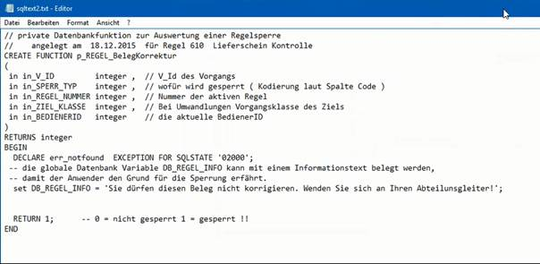
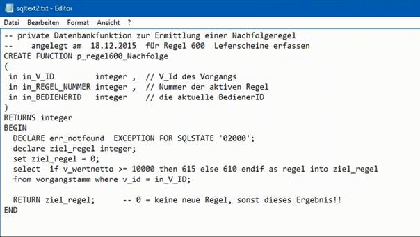

# Regeleinrichtung [REGEL]

<!-- source: https://amic.de/hilfe/regeleinrichtungregel.htm -->

Hauptmenü > Administration > Formulare / Abläufe > Arbeitsregeln verwalten

oder Direktsprung <strong>[ARV]</strong> oder <strong>[REGEL]</strong>

Der Einrichtungsbildschirm einer Regel gliedert sich in folgende Bereiche:

  <table>
    <tbody>
      <tr>
        <td></td>
        <td></td>
      </tr>
      <tr>
        <td>
          
Arbeitsregel

        </td>
        <td>
          
Hier wird die Nummer der Arbeitsregel angegeben. Nummer 0 darf nicht vergeben oder verändert werden.

          
Diese Nummer der Arbeitsregel wird beim Anlegen eines Vorgangs im Vorgangstamm gespeichert und ist unter [FRZ] für die entsprechende Vorgangsklasse einzurichten.

        </td>
      </tr>
      <tr>
        <td>
          
Name

        </td>
        <td>
          
Hier kann der Name für die Arbeitsregel festgelegt werden.

        </td>
      </tr>
      <tr>
        <td>
          
Kurzbezeichnung

        </td>
        <td>
          
Kurzname für die Arbeitsregel

        </td>
      </tr>
    </tbody>
  </table>

| Sperren | |
| --- | --- |
| Code | Nummer der Funktionalität für die Belege mit dieser Arbeitsregel gesperrt werden können |
| Sperre für … | Belege, die diese Arbeitsregel enthalten, können für folgende Funktionalitäten gesperrt werden: 1 – Druck 2 – Fibu-Übertrag 3 – Korrektur 4 – Ansehen 5 – Storno 6 – Umwandlung 7 – Artikel löschen 8 – Artikel neu erfassen 9 – Menge korrigieren 10 – Preis korrigieren 11 – Regel setzen 12 – Regel korrigieren |
| Typ | Die Art wie der Beleg für die entsprechende Funktionalität behandelt werden soll, wenn er diese Arbeitsregel enthält F3- Auswahl: \-keine \-Datenbank Funktion: Eine Funktion, deren Name im nächsten Feld anzugeben ist, regelt das Verhalten für den Beleg der diese Arbeitsregel enthält. \-SQL-Text: Ein SQL-Text regelt das Verhalten für den Beleg \-immer sperren: Belege die diese Arbeitsregel enthalten sind immer gesperrt für die jeweilige Funktionalität, z.B. Druck, wird trotzdem versucht den Beleg zu drucken erhält man eine entsprechende Fehlermeldung mit Hinweis auf die Arbeitsregel   |
| SQL / Funktion | Hier wird der Name der Funktion angegeben die für die entsprechende Funktionalität wirken soll. Gibt man hier einen Namen ein kann über die Funktion **Editieren/Neu F5** in den Pfleger gewechselt und die Funktion bearbeitet oder angelegt werden. Diese Funktion muss 1 (gesperrt) oder 0 (nicht gesperrt) zurückliefern. |

Grundgerüst für eine Datenbankfunktion zur Auswertung einer Regelsperre:

Hier wurde für ein Beispiel hinter RETURN die 1 (für gesperrt) fest codiert eingetragen.  
Mit der globalen Datenbankvariablen DB_REGEL_INFO kann man einen Informationstext hinterlegen, damit der Anwender den Grund für die Sperrung erfährt.

  <table>
    <tbody>
      <tr>
        <td>
          
<strong>Nachfolgeregel</strong>

        </td>
        <td></td>
      </tr>
      <tr>
        <td colspan="2">
          
Hier stellt man ein, dass es eine Vorschrift gibt wie die Regel automatisch verändert wird, wenn ein Beleg korrigiert oder die Regel neu gesetzt wird.

          
 Im oberen großen Feld dieses Registers wird der Programmcode der ausgewählten Funktion als Vorschau angezeigt. Für ‚kein Nachfolger‘ bleibt das Feld leer.

        </td>
      </tr>
      <tr>
        <td>
          
Typ

        </td>
        <td>
          
F3-Auswahl: kein Nachfolger Datenbank Funktion Privater SQL

        </td>
      </tr>
      <tr>
        <td>
          
SQL / Funktion

        </td>
        <td>
          
Hier wird der Name der Funktion angegeben die für die Nachfolgeregel wirken soll.

          
Gibt man hier einen Namen ein kann über die Funktion <strong>Editieren/Neu F5</strong> in den Pfleger gewechselt und die Funktion bearbeitet oder angelegt werden.

        </td>
      </tr>
    </tbody>
  </table>

Beispiel für eine Datenbankfunktion zur Ermittlung einer Nachfolgeregel:

Hier wird beim Speichern des Lieferscheins (der mit der Arbeitsregel 600 angelegt wurde) abhängig vom Betrag als Arbeitsregel die 615 oder 610 eingetragen.

  <table>
    <tbody>
      <tr>
        <td>
          
<strong>Gültigkeit</strong>

        </td>
        <td></td>
      </tr>
      <tr>
        <td colspan="2">
          
Diese Regel darf nur durch eine andere Regel ersetzt werden, die in mindestens einer der hier aufgeführten Bereiche liegt. Wird kein Bereich festgelegt, gibt es keine Einschränkung. Bereiche mit leeren Einträgen werden nicht gespeichert!

        </td>
      </tr>
      <tr>
        <td>
          
von Regel

        </td>
        <td>
          
Hier wird die Nummer der Arbeitsregel eingetragen mit der der Bereich beginnen soll.

        </td>
      </tr>
      <tr>
        <td>
          
bis Regel

        </td>
        <td>
          
Hier wird die Nummer der Arbeitsregel eingetragen mit der der Bereich enden soll.

        </td>
      </tr>
      <tr>
        <td>
          
nur größere Regel zulässig

        </td>
        <td>
          
Hier kann festgelegt werden, dass Arbeitsregeln nur in Regeln mit einer größeren Nummer geändert werden können.

        </td>
      </tr>
    </tbody>
  </table>

Wird versucht die Arbeitsregel eines Beleges in eine Regel außerhalb des angegebenen Bereichs zu ändern, bekommt man eine Fehlermeldung mit dem Hinweis Bereichsverletzung.

| Test Beleg | |
| --- | --- |
| Beleg zum Testen | Hier legt man einen Test Beleg für die Funktion ***Statement testen F10*** fest. Diese Funktion kann man aus der Option Box aufrufen, wenn man mit dem Cursor im Register Nachfolgeregel im Feld SQL/Funktion steht. |
| Vorgangsklasse | Vorgangsklasse des Testbelegs |
| BelegNummer | Nummer des Testbelegs |
