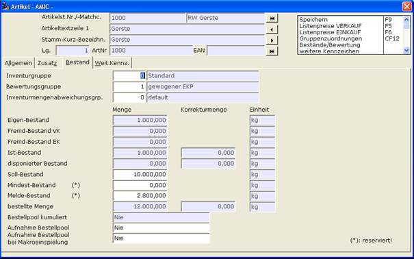

# ARTIKEL   [AR]

<!-- source: https://amic.de/hilfe/artikelar.htm -->

#### ARTIKEL [AR]

  <table>
    <tbody>
      <tr>
        <td colspan="2"></td>
      </tr>
      <tr>
        <td>
          
<strong>Feld</strong>

        </td>
        <td>
          
<strong>Bemerkung</strong>

        </td>
      </tr>
      <tr>
        <td>
          
Sollbestand

        </td>
        <td>
          
Bis zu diesem Bestand wird entsprechend der Bestellgröße aufgefüllt. Ist dieser Bestand auf 0 gesetzt, so wird der Mindestbestand gezogen.

        </td>
      </tr>
      <tr>
        <td>
          
Mindestbestand

        </td>
        <td>
          
Findet keine Berücksichtigung hinsichtlich der Berechnung der Bestellmenge. Ist der verfügbare Bestand niedriger als der Mindestbestand so wird dieser Bestellvorschlag in ROT gekennzeichnet.

        </td>
      </tr>
      <tr>
        <td>
          
Meldebestand

        </td>
        <td>
          
Unterschreitet der verfügbare Bestand diesen Meldebestand so erscheint dieser Artikel in die Bestellvorschlagsliste. Dieser Bestellvorschlag wird in GELB gekennzeichnet.

        </td>
      </tr>
    </tbody>
  </table>

<strong><em><u>Anmerkung</u></em></strong><em><u>:</u></em>

Die Bestellsperre im Artikel und im Kunden/Lieferantenstamm werden berücksichtigt in der Auswahlliste !!
