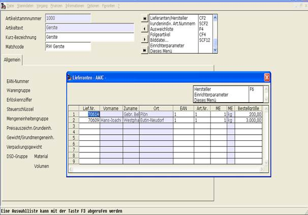

# ARTIKELSTAMM   [ARS]

<!-- source: https://amic.de/hilfe/artikelstammars.htm -->

#### ARTIKELSTAMM [ARS]

Lieferant (F3 – Auswahl)

EAN (nur für Formulardruck)

Artikelnummer (des Lieferanten)

Mengeneinheit (der Bestellgröße)

Bestellgröße

Die Mengeneinheit muss passend zur Grundmengeneinheit des Artikels gewählt werden, da sonst dieser Lieferant in der Bestellvorschlagsliste nicht erscheint.

Artikel mit Gebinde werden in den Bestellvorschlägen z.Zt. nicht unterstützt. Der Bedarf dieser Artikel kann bei den Bestellvorschlägen gesondert betrachtet werden, muss aber manuell erfasst werden.
