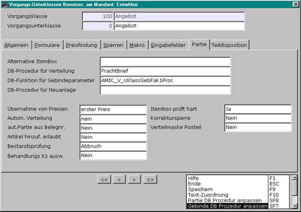
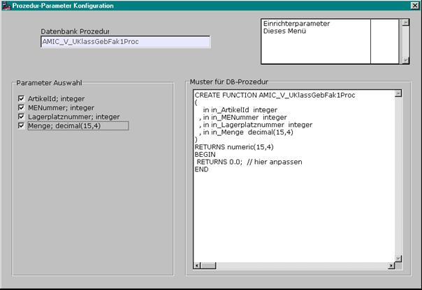

# Datenbankfunktion für Gebindeparameter

<!-- source: https://amic.de/hilfe/_frz_partie_dbfunc_gebindeparameter.htm -->

Hier kann eine private Datenbankfunktion für die Gebindeparameter eingetragen werden.

Die rechnet dann z.B. aus der Keimfähigkeit und dem TausendKörnerGewicht aus wie viel schwerer ein Gebinde sein muss, damit man z.B. tausend keimfähige Körner garantieren kann.

Parameter die unbedingt an diese Funktion übergeben werden müssen sind

ArtikelId, MeNummer, LagerPlatzNummer, Menge. Wird mit Partien gearbeitet, dann muss die temporäre Tabelle Temp_Partie_Uebergabe genutzt werden. Hier muss für jeden Datensatz die Menge entsprechend angepasst werden. Wichtig ist dabei die Menge auf zwei Nachkommastellen zu runden, sonst kann es zu Differenzen kommen. Zurückgegeben wird die Summe der Menge über alle Partiedatensätze.

Wird ohne Partien gearbeitet reicht es wenn die gerundete Gesamtmenge zurückgegeben wird.

Ein Beispiel findet man unter ‚Beispiele für Datenbankfunktionen’

Die Software Company AMIC macht Ihnen gerne ein Angebot für eine eigene Datenbankfunktion, speziell abgestimmt auf Ihre Bedürfnisse.

Man hat die Möglichkeit die private Datenbankfunktion mit F3 auf dem Feld auszuwählen. Ist das Feld gefüllt erscheint in der Option Box die Möglichkeit mit SHIFT+F7 die zu übergebenen Parameter an die Funktion auszuwählen. Hier wird also festgelegt welche Informationen für die Funktion zur weiteren Verarbeitung gebraucht werden. Da jeder Anwender andere Ansprüche hat wurde hier die Möglichkeit geschaffen die Parameter variabel zu halten.

[Beispiel hier](./beispiele_fuer_datenbankfunktionen.md)
