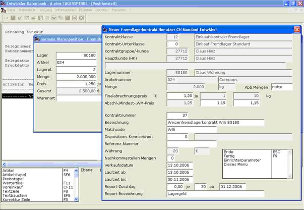

# Erfassung

<!-- source: https://amic.de/hilfe/erfassung.htm -->

Die Erfassung einer Fremdware- oder Fremdlagerrechnung also eines Vorverkaufs oder Voreinkaufs erfolgt in A.eins über die Standardbelegerfassung. Im Falle des Vorverkaufs über die Rechnungserfassung [REE] und im Falle des Voreinkaufs über die Eingangsrechnungserfassung [ERE]. Im Positionsteil muss dann die Funktion „Vorverkauf“ oder „Voreinkauf“ (STR-F11) angewählt werden. Es öffnet sich das Warenerfassungsfenster und die Angaben zur Ware können eingegeben werden. Falls noch kein Fremdware- bzw. Fremdlagerkontrakt für die erfasste Ware existiert, das heißt ein Kontrakt, der in Kunde, Artikel, Lager und Lagerplatz mit der erfassten Position übereinstimmt, der Steuerparameter „Neuer Fremdwarekontrakt je Vorverkauf (306)“ bzw. „Neuer Fremdlagerkontrakt je Voreinkauf (580)“ oder es sich um einen Rohwareartikel handelt, öffnet sich nach Erfassung der Warenposition ein Fenster, in dem Angaben zu dem Fremdware- bzw. Fremdlagerkontrakt gemacht werden können, der für diese erfasste Position angelegt wird. Dieser Kontrakt übernimmt automatisch die Angaben zum Kunden, Artikel, Lager und Lagerplatz aus der Warenposition. Ansonsten wird der bereits bestehende Kontrakt um die Menge der erfassten Warenposition erhöht. In diesem Fall wird das Kontraktfenster nicht angezeigt.

Nach Abschluss der Rechnung und Behandlung durch den Mandantenserver, wird der so erfasste Fremdlager- bzw. Fremdwarebestand im Artikelbestand angezeigt. Fremdbestände werden unter „Fremdware“ angezeigt und werden und gehören mit zum Istbestand, nicht aber zum Eigenbestand. Fremdlagerbestände werden unter „Fremdlager“ angezeigt und gehören mit zum Eigenbestand, nicht aber zum Istbestand.

Der erzeugte Kontrakt kann in der Kontraktübersicht [KTR] bearbeitet werden. Die Artikelangaben in diesem Kontrakt sind allerdings nicht direkt änderbar, sondern können nur durch Änderung der dazugehörigen Vorverkaufs- bzw. Voreinkaufsrechnung modifiziert werden.

Auf diese Art und Weise können jetzt Fremdware- und Fremdlagerbestände aufgebaut werden.
