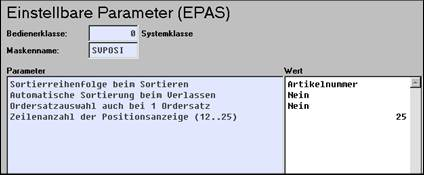
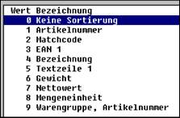

# Parameter für den Positionsteil

<!-- source: https://amic.de/hilfe/parameterfrdenpositionsteil.htm -->

Auch die Abläufe der Erfassung werden entscheidend durch die Einstellung der Erfassungsparameter für den Positionsteil sowie der Steuerungsparameter bestimmt.

### Sortierreihenfolge beim Sortieren

Hier kann eingestellt werden, ob und wie die Positionen eines Vorganges beim Abschluss automatisch neu sortiert werden sollen. Folgende Möglichkeiten bestehen:

Ein entsprechend sortierter Lieferschein kann z.B. für die Lagerentnahme hilfreich sein.

### Ordersatzauswahl auch bei einem Ordersatz

Wenn für den Kunden nur ein Ordersatz vorliegt, kann die Auswahl über eine Liste nur sinnvoll sein, wenn man auf die Liste anderer Kunden oder einen Standardordersatz zugreifen will. Ist dies nicht der Fall, entfällt dieser Schritt und der eine Ordersatz wird direkt gezogen.

### Zeilenanzahl der Positionsanzeige

Hier kann eingestellt werden, wie viele erfasste Positionszeilen angezeigt werden sollen.
